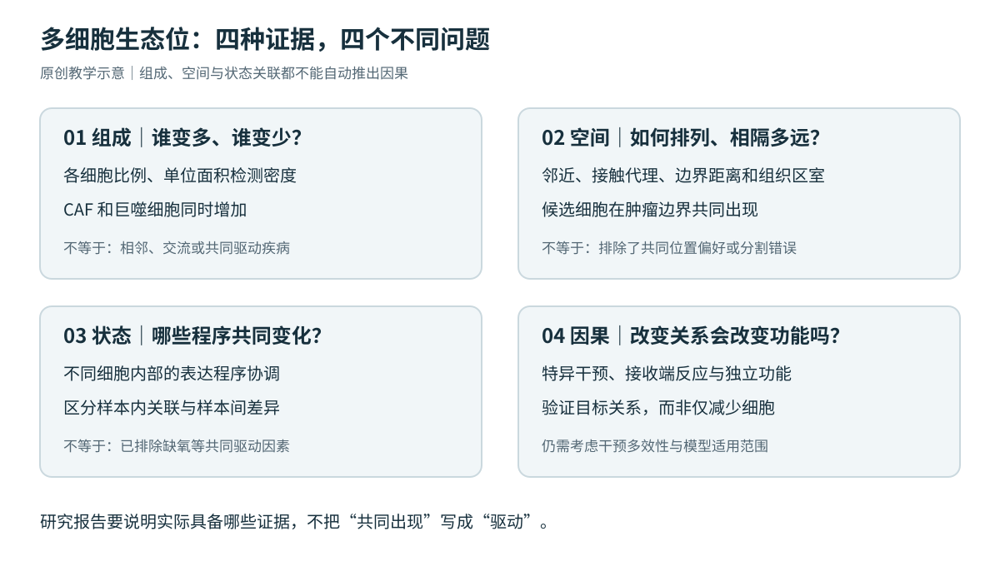

# 多细胞生态系统：Xenium 癌症、TME 与促纤维炎症知识库

**文章标题：** Multicellular ecosystems: Linking cellular diversity to tissue function and disease

**文章链接：** [期刊原文](https://www.sciencedirect.com/science/article/pii/S0962892426001042) · [DOI](https://doi.org/10.1016/j.tcb.2026.06.005)

**第一张主图（Figure 1）：**

[](https://www.sciencedirect.com/science/article/pii/S0962892426001042#fig1)

*来源：[Trends in Cell Biology · Figure 1](https://www.sciencedirect.com/science/article/pii/S0962892426001042#fig1)。图片由出版社网站外链展示，版权归原作者及出版方。*

---

> 基于 Shi, Tang, Chen & Zhang, *Trends in Cell Biology* (2026), **Multicellular ecosystems: Linking cellular diversity to tissue function and disease**。DOI：[10.1016/j.tcb.2026.06.005](https://doi.org/10.1016/j.tcb.2026.06.005)。
>
> **这是证据分层的研究与教学知识库，不是作者官方资源，也不是完成的科学复现。** 本次核验覆盖摘要、出版社可检索正文片段及所列原始研究/官方文档；未取得目标综述完整可逐页核读的正文和全部图表。访问范围见[阅读边界](evidence/reading-scope-and-gaps.md)。

**核心问题：怎样从“几类细胞一起出现”，走到可信的多细胞空间组织、状态协调与机制候选？**



*图 1：本知识库原创教学示意。四类证据互补，图中不表示由相关自动推导因果；不是论文 Figure 1。*

## 分类

主类：**空间组学 → 多细胞生态系统与组织生态位**。交叉分类：**肿瘤微环境 / CAF–髓系 / 促纤维炎症 / 空间统计 / 工作流 / Agent 知识库**。

| 阅读目的 | 入口 |
|---|---|
| 理解研究逻辑与证据层次 | [01 概念和研究逻辑](knowledge/01-evidence-framework.md) |
| 避免把纤维化、炎症、免疫抑制混为一谈 | [02 促纤维炎症生物学](knowledge/02-fibro-inflammatory-biology.md) |
| 检查面板、分割和空间质量 | [M01 Xenium 测量边界](methods/01-xenium-panel-segmentation-qc.md) |
| 选择 niche、协同程序与模块方法 | [M02 方法选择](methods/02-niches-and-coordination.md) |
| 设计可辩护的统计分析 | [M03 统计与空间零模型](methods/03-statistics-and-spatial-nulls.md) |
| 从候选通讯走向机制验证 | [M04 通讯与因果](methods/04-communication-and-causality.md) |
| 按步骤组织项目 | [W01 端到端工作流](workflows/01-end-to-end.md) · [W02 报告检查表](workflows/02-reporting-checklist.md) |
| 迁移到 CAF–巨噬–肿瘤生态位 | [A01 研究设计](applications/01-caf-myeloid-tumor-niche.md) |
| 处理跨时期或跨癌种迁移 | [A02 时序和迁移边界](applications/02-temporal-and-cross-cancer-transfer.md) |
| 给 Agent 按需读取 | [AGENTS.md](AGENTS.md) · [FAQ](agent/faq.md) · [论断表](evidence/claims.jsonl) |
| 查原始依据与配图 | [来源](evidence/sources.json) · [配图索引](figures/README.md) |

## 证据标签

`ARTICLE_FACT`：目标综述可核验表述；`EXTERNAL_FACT`：另行核验的原始研究；`DOC_FACT`：官方技术文档；`ANALYSIS`：本知识库解释/推导；`TRANSFER`：迁移建议或待检验假说；`CODE_AUDIT`：代码审读事实，本版没有此类科学方法审读结论。

所有模型结构、邻域尺度和工作流组合，除另有明确来源外，均为 `TRANSFER`，不能写成作者最终参数。文中四张 SVG 均为原创示意，不含患者数据、实验结果或出版社原图。

## 轻量检索

需要 Python 3.10+，不依赖第三方包；检索是词项/中文片段匹配，不调用模型，不运行生物信息分析。

```bash
python tools/kb.py search "伪重复"
python tools/kb.py search "CoVarNet 上皮" --limit 3
python tools/kb.py show C015
python tools/kb.py validate
python -m unittest discover -s tests -v
```

检索返回论断标签、来源、适用边界和章节路径。不得把某条方法建议检索命中，解释为该方法已在用户数据上得到验证。

## 与已有 idea 的连接

[serpin–ECM–myeloid](../2026-09-serpin-myeloid-spatial-niches/README.md)：具体机制案例；[癌症共同演化](../2026-09-cancer-coevolution-agent-kb/README.md)：演化解释边界；[Xenium 时空演进](../Xenium-based-SpatioTemporal-Evolution-Profiling/)：时序研究；[Xenium-CNV](../Xenium-CNV/)：克隆/拷贝数与局部生态位。

这些连接用于导航，不代表本次重新核读了各目录内全部材料。仓库总分类见 [CATALOG](../CATALOG.md)。
