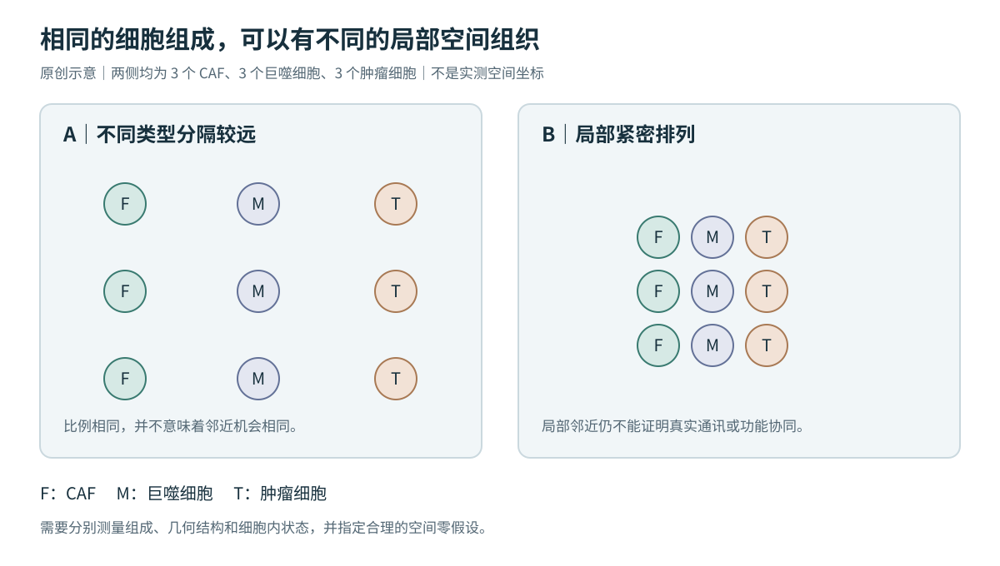

# 02｜促纤维炎症不是一个万能总分

## EXTERNAL_FACT：CAF 状态可以受不同方向的信号控制

Biffi 等在 PDAC 相关模型中报告，IL1 通过 LIF–JAK/STAT 促进炎症性 CAF，而 TGFβ 可通过下调 IL1R1 拮抗该过程并促进肌成纤维样分化。定位：原文摘要；不能外推为所有癌种、所有时段的固定二分法。[R13](https://pubmed.ncbi.nlm.nih.gov/30366930/)

Özdemir 等在特定小鼠模型中报告，清除 αSMA 阳性肌成纤维细胞可伴随免疫抑制、胰腺癌加速和生存缩短。原研究另有勘误；本版仅采用摘要层面的谨慎结论，不复述具体实验参数。[R14](https://pubmed.ncbi.nlm.nih.gov/24856586/)

## ANALYSIS：不要把身份、状态和功能混成一个标签

“CAF”“SPP1 高表达细胞”“免疫抑制细胞”分别涉及身份、表达状态与功能解释。单个标志基因不应同时证明三者。跨癌种迁移时，应依次核对细胞谱系、完整程序、位置和接收端反应，而非只检查名称是否相同。

## TRANSFER：保留分量，研究耦合

| 层面 | 建议分别记录 | 不宜直接推断 |
|---|---|---|
| CAF | ECM 生成/重塑、收缩、炎症/趋化 | 一条总分代表所有纤维化功能 |
| 髓系 | 炎症、吞噬/脂质处理、修复、候选免疫调节 | 一个标志等于稳定免疫抑制能力 |
| 肿瘤 | 增殖、应激、缺氧、侵袭相关表达 | RNA 程序等于真实侵袭速率 |
| T 细胞 | 空间进入与细胞内状态分开 | T 细胞少足以证明主动排斥 |
| 组织 | 基质沉积/排列、血管、坏死、病理边界 | ECM RNA 分数等于基质力学性质 |

先在各自细胞类型内部评分，再研究跨细胞类型关联。否则全 ROI 的 ECM 信号升高可能只是 CAF 更多，而不是每个 CAF 更活跃。程序覆盖、每类细胞的有效数量和不确定性都要记录。

*图 2：原创示意，两边各有 3 个 CAF、3 个巨噬细胞、3 个肿瘤细胞；布局差异不是实验结果。图只说明比例不能唯一决定空间关系。*

## TRANSFER：干预优先问“改变哪种关系”，而不是“清除哪一大类”

候选靶点应同时满足可测量、局部富集、接收端反应和跨样本一致等条件。评价不应只有靶基因下降，还应包括接收细胞状态、组织结构及独立功能终点。阻断模型中的一条候选关系是研究假说，不是临床疗效判断。
