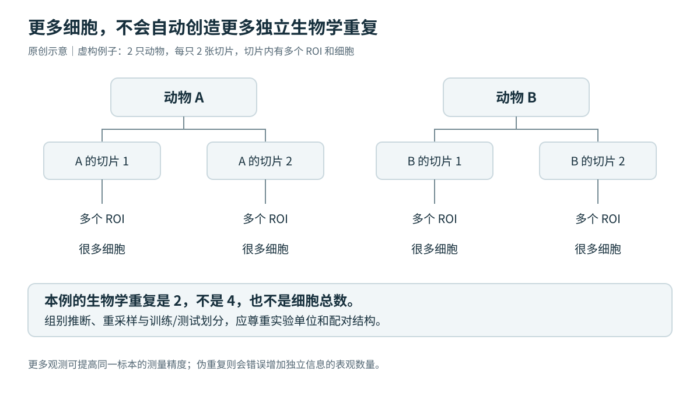

# M03｜统计单位、空间零假设与状态协调

## 1. EXTERNAL_FACT：生物学重复不能被细胞数量替代

Squair 等的研究说明，忽略生物学重复间变异会产生假阳性；原论文 Fig. 2a 描述按细胞类型与真实生物学重复聚合，Fig. 3 比较真实重复和人为伪重复。[R11](https://pubmed.ncbi.nlm.nih.gov/34584091/)

*图 3：原创教学示意。图中数量是虚构例子；多个切片和 ROI 可提高对同一标本的测量，但不会自动创造新动物/患者。*

## 2. TRANSFER：先写 estimand，再写模型

明确要估计的是组间细胞比例、单位面积检测密度、细胞内表达，还是区室内空间富集。标本—切片—ROI—细胞可能嵌套；配对或重复测量不能被拆成独立行。差异表达可从“生物学重复 × 细胞类型（必要时 × niche）”的原始计数聚合起步，保留配对与技术结构。

scCODA 是组成数据模型的原始研究实例。[R12](https://doi.org/10.1038/s41467-021-27150-6) 本知识库建议并列报告比例、有效面积检测密度和空间关系。比例上升可能来自其他类型减少；检测密度仍受分割、组织切面和质量影响。不能用 log1p、整合或插补矩阵静默替代计数模型输入。

## 3. ANALYSIS：图零模型到底在问什么

设固定的无向简单图为 E，有 n 个节点，A、B 为不同类型、数量分别 n_A、n_B。在所有标签全局可交换且数量固定的随机标签零模型下，A–B 边数的期望是：

\[
\mathbb E_0[O_{AB}]=|E|\frac{2n_An_B}{n(n-1)}.
\]

这是本知识库的组合概率推导，不是任意空间图上的普适生物学零模型。有向图、自环、加权边、同型边、条件置换需改变定义；稀有类型下观察/期望比值也可能非常不稳定。

**全局随机标签**检验整张组织是否超出随机混合。**在病理区室或预先合理分层内置换**检验在既有组织结构条件下是否仍有额外关系。不同零模型回答不同问题；分层过细会限制可交换性，分层变量若为中介或碰撞点也可能改变目标或引入偏差。应报告总体关系与条件关系，不宣称“控制越多越正确”。

Squidpy 邻域富集的官方接口使用空间连接与标签置换；它不会替研究者证明交换性。[R08](https://squidpy.readthedocs.io/en/stable/api/squidpy.gr.nhood_enrichment.html)

蒙特卡洛单侧检验可用 `p=(1+#(T_perm >= T_obs))/(B+1)`，并预先定义方向与统计量；不能报告 p=0。完整枚举使用枚举分布计数，不机械套用加一式。组别比较的置换单位原则上是与设计相符的独立实验单位，不是全体细胞。

## 4. TRANSFER：把样本内关联和样本间差异分开

令 M_dr 为样本 d 的 ROI r 中巨噬细胞程序，Y_dr 为同 ROI 的 CAF 程序。记样本均值为 Mbar_d，样本内偏差为 Mtilde_dr=M_dr−Mbar_d。一个示意模型为：

\[
Y_{dr}=\beta_0+\beta_G G_d+\beta_W\widetilde M_{dr}+\beta_B\bar M_d
+\delta_W G_d\widetilde M_{dr}+\delta_B G_d\bar M_d
+\gamma^T X_{dr}+b_d+\epsilon_{dr}.
\]

`delta_W`对应组间样本内关联斜率差，`delta_B`对应样本间关联差。这种拆分避免把两类信息混为一个交互项，但不解决所有混杂。样本均值的 ROI 权重应预先定义。少量独立样本可能不足以支持该模型，不应因公式可写就拟合所有项。

可按研究设计考虑病理区室、边界距离和测量质量；组成变量是否调整取决于问题是总体效应还是条件关联。随机截距不自动消除空间残差相关，重叠邻域也不独立。可采用非重叠区域、合适空间模型或与设计相符的分块/分层重采样并检查敏感性。交互显著仍不是分子协同或因果证明。

## 5. TRANSFER：独立验证与多重选择

用 ECM 特征定义 niche，再检验该 niche 的同一 ECM 特征，只是在重述定义。优先用未参与定义的形态、蛋白、功能终点或独立样本验证；独立特征也不等于因果证据。若 Tlow 按 T 细胞数量定义，T 少不能再次作为独立验证。

训练/测试按患者或动物划分；同组织随机拆细胞容易产生空间泄漏。预先确定主终点、主尺度和主要对比，完整保留探索的基因集、阈值、半径与聚类选择；按预先声明的检验族控制多重检验，不能只展示最好的一组结果。

最终至少展示逐样本效应、区间、不确定性和留一样本敏感性。大 Z-score 不等于大效应，不同样本的 Z-score 不能直接作为作用强弱的通用刻度。
