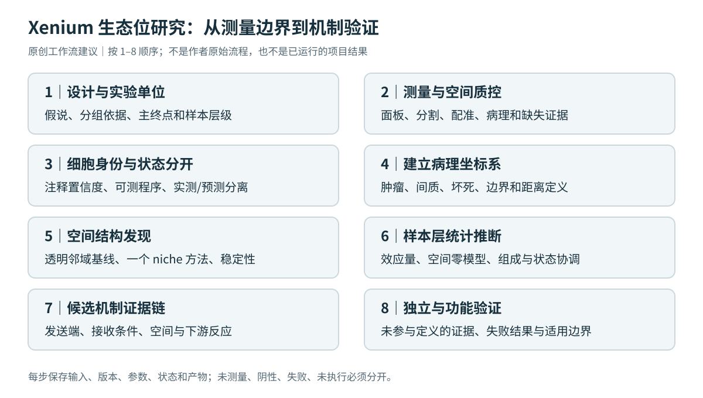

# W01｜端到端工作流（TRANSFER）

*图 4：原创工作流示意，不是综述给出的作者流水线。每一步都有输出和不满足条件时的处理。*

| 阶段 | 主要工作 | 最小交付与决策 |
|---|---|---|
| 1 设计 | 写假说、实验单位、主要终点和分组依据 | `sample_manifest.tsv`；分组与批次完全混杂时，不声称模型可分离二者 |
| 2 测量审计 | 面板、分割、坐标、病理配准、空间 QC | 覆盖表与 ROI 审核；不可测程序降级或不做 |
| 3 注释与状态 | 大类、可支持亚群、不确定标签；细胞内程序 | 注释证据表；参考映射与实测分开 |
| 4 病理坐标 | 肿瘤/间质/坏死等；边界有符号距离 | 掩膜、坐标单位、配准误差和边界定义 |
| 5 结构发现 | 基线邻域统计加一个 niche 框架 | 逐样本 niche 指标、图构建与敏感性 |
| 6 样本层推断 | 组成、状态、空间三个目标分开 | 效应量、区间、模型、检验族、残差与稳健性 |
| 7 候选机制 | 发送—接收—空间—响应链 | 候选证据表，明确未测量与不支持项 |
| 8 验证和报告 | 独立样本、正交测量、必要的功能验证 | 结果、失败分析、可复查 manifest；不把未执行写成阴性 |

## 推荐的顺序与停点

在全局细胞通讯网络之前，先确定哪些样本中存在候选空间结构。关键面板节点缺失时，不应通过插补把证据补“完整”；可将假说保留为待外部测量验证。独立样本不足时，描述性逐样本证据可能比复杂模型更可靠。

## 产物合同

建议保存原始数据引用与校验、版本、随机种子、基因映射、面板过滤、注释规则、图构建、统计公式、全部测试和文件索引。`results_manifest.json` 应至少给出每个文件的用途、输入、生成步骤和状态：`planned / executed / failed / not_applicable`。

本知识库没有用户真实数据，没有执行以上分析；这些是项目组织建议，不是作者使用的软件版本或最终参数。详见[报告检查表](02-reporting-checklist.md)。
