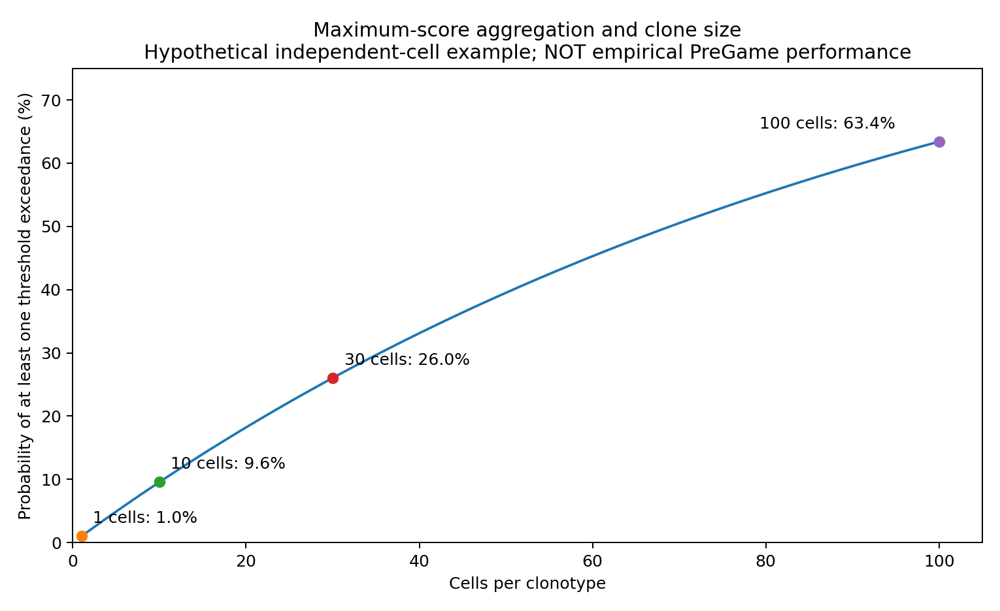

# PreGame论文研究重建与审计

**阅读版：2026年9月18日。** 本文集包含研究逻辑、118个panel的图注层索引、数学附录和真实复现路线。作者代码、权重、原始数据未取得；不是原作者流程执行报告。来源定位见各章。


---

# PreGame论文深度重建：从克隆身份、功能真值到条件性肿瘤识别

**对象**：St. Paul, Hendrikse, Ying et al., *Identification of broadly tumour-reactive γδ TCRs from multiple myeloma*, Nature，2026年9月16日，DOI 10.1038/s41586-026-11055-9。

**阅读层次**：下文的“论文报告”来自最终出版文章或注明版本的审稿回复；“独立审计”是对设计与统计的判断；“迁移建议”不是作者完成的工作。所有代码实现结论均保持空缺：作者Zenodo包、模型权重和实际运行日志未取得。在线来源与具体定位见文末及 `../provenance/WEB_READING_LEDGER.md`。本文件不是原文翻译，也不把文献阅读称为复现。

---

## 1. 总判断：论文真正有价值的不是一个随机森林

这项研究最值得重建的是一条研究链：临床治疗后出现的γδ T细胞信号，经过克隆级功能筛选，变成可预测、可追踪的细胞群；再从一个具有广泛反应性却也自反应的TCR出发，追问为什么健康组织没有同等受损，最终得到“激活信号与抑制信号联合决定识别结果”的机制假说。[PAPER Fig.1–6]

这个链条包含三种不能混淆的结论。

第一，**部分来源于MM的γδ TCR能够赋予细胞肿瘤识别能力，并在所测试的原代γδ细胞体系中对识别与杀伤有重要贡献**。TCR移植、原代细胞、阻断以及靶细胞基因扰动构成互补证据；这是论文较强的机制部分。[PAPER Fig.2f, Fig.4f–h, Fig.6b–e]

第二，**PreGame可作为候选克隆优先级排序工具**。它用单细胞表达表型筛选值得克隆和实验验证的受体，降低实验搜索成本。它不是仅输入CDR3序列就预测抗原特异性的模型，也不是所有癌种通用的诊断器。[PAPER Methods: PreGame development; REVIEW PDF pp.67–71]

第三，**治疗后TR相关克隆扩张、血浆δ链read fraction变化和临床结局相关**。这支持探索性治疗中监测指标，不足以证明γδ T细胞是BPd获益的必要临床中介，也不足以证明该指标能指导不同疗法间的选择。[PAPER Fig.1b, Fig.5; 独立审计]

我的评价是：机制发现与功能验证链值得学习；机器学习的泛化评估、临床推断的边界和材料一致性必须单独审计。不能用“Nature发表”替代这些检查，也不能因为统计问题就抹去受体移植和遗传扰动的证据。

## 2. 作者最初面对的不是“哪个cluster更高”，而是四个竞争解释

### 2.1 肿瘤内γδ细胞为什么与好结局同时出现？

假说A：γδ TCR识别肿瘤相关配体，参与抗肿瘤反应。假说B：这些细胞主要依靠NK样受体，TCR只是旁观者标识。假说C：治疗先减少肿瘤负担，改善微环境，γδ细胞随之恢复；它们是结果或伴随现象。假说D：组织组成、取样和克隆扩张造成相对丰度变化，与实际杀伤机制无直接对应。

仅凭GZMB高、γδ细胞多、TCR扩张或PFS曲线分开，不能区分四者。研究采用“把受体拿出来放入另一种细胞”的策略，直接检验受体是否携带识别信息；再用原代γδ TCR阻断检验其功能贡献。这种设计是从相关性走向机制的关键，而不是UMAP形状本身。[PAPER Fig.2, Fig.4]

### 2.2 为什么广谱识别没有自动导致广泛自身免疫？

若受体识别多个肿瘤共有的结构，这个结构也可能出现在健康细胞。故“广谱”与“安全”不是同义词，而是潜在冲突。作者没有简单丢弃自反应TCR65，而是追踪其抑制受体，提出HLA-C激活与Bw4–KIR3DL1抑制的平衡。[PAPER Fig.6]

独立解释：真正有迁移价值的设计习惯是**利用反例缩小解释空间**。若一个TCR只认肿瘤不认健康，容易停留在“肿瘤特异”；若它也认健康，却在原供者中存在，问题就变成“什么条件约束了它”。后者更容易产生可干预的条件机制。

## 3. 队列、样本、细胞、克隆与实验重复必须分开

|层次|论文/档案报告|用途|不能偷换成什么|
|---|---|---|---|
|ALGONQUIN血液患者|37位；cfDNA基线–C2D1配对分析31位|治疗相关免疫变化和PFS|37位均进入每项检验|
|ALGONQUIN骨髓|基线12份，C2D1 13份|单细胞表型及克隆追踪|13个完整基线–治疗后配对|
|PreGame独立MM队列|22位，发现8位、验证1为6位、验证2为8位|模型开发与候选验证|449个独立训练患者|
|全部整合细胞|157,636个|包括肿瘤与其他免疫群体的整合图谱|全部都是γδ细胞或监督训练样本|
|γδ细胞|正文超过9,500；S4转录求和9,574|TCR提取和表型定位|9,574个功能真值|
|配对克隆型|正文672；验证队列合计543|受体候选空间|S4 full-sequence计数必然同口径|
|发现监督细胞|TR 88、NTR 361|27维训练矩阵|449个独立功能实验|
|后续DE细胞|TR 1,616、NTR 374|生物学比较|两组细胞完全独立|
|后续DE克隆型|TR 48、NTR 73|克隆扩张与平衡下采样|48位TR患者与73位对照|

来源：[PAPER Results/Methods; TABLES S4; EGA-ALQ; EGA-PG]。

### 3.1 已确认的缺失基线问题

Methods明确说ALQ-19-019因基线骨髓活性差，无法完成baseline测序。与此同时，Fig.5b/c按10位应答者、3位非应答者和n=13描述基线到C2D1的TR比例fold change。缺失基线的存在已经确认；它究竟怎样进入FC和PFS分组，公开文字未给出足够答案。[PAPER Acquisition of patient samples; Fig.5b/c]

正确处理不是直接判定“伪造了一个样本”，也不是自行假设作者做了插补。需要一张患者×时点×分析入组矩阵，明确：该患者是否不参与FC计算、图注n指总体队列还是实际比较人数、是否存在另一个非单细胞baseline测量、是否用了特定零值规则。

### 3.2 补充表揭示的供者贡献不均衡

本次对S4解析文本做了独立算术：22行总γδ细胞9,574，其中MM15为6,879，占71.85%。这意味着总体单细胞数量的很大部分来自单一供者。**它并不说明发现训练集必然被MM15支配**：发现队列和所有细胞不是同一集合，必须先对齐样本角色。[TABLES S4; 本包 audit/arithmetic_checks.json]

S4“unique paired gd TCR seqs”求和766，而正文“unique paired clonotypes”为672。这里首先需要数据字典：full sequence key、clonotype key、不同pipeline和质控前后计数可能不同。没有映射表，不能把差值94个直接解释为错误，也不能声称已成功重现672个克隆。

EGA中PreGame单细胞dataset显示11个samples，论文为22位供者。考虑到样本混合测序，档案sample、文库与生物供者可能是不同层次。该数字不是“只公开了一半患者”的证据。[EGA-PG]

## 4. 整篇研究的因果与分析路径

```text
临床现象：BPd后δ链cfDNA变化与PFS相关
               ↓ 需要找到组织来源与细胞身份
骨髓 GEX + ADT + αβ/γδ VDJ + BCR
               ↓ 需要识别TCR到底是否带来功能
配对γδ TCR → 标准化报告细胞 → 肿瘤/健康/供者匹配筛选
               ↓ 实验标签回填，不从marker臆测真值
单细胞表型 → PreGame → 新供者候选克隆 → 再做功能实验
               ↓                         ↓
克隆/表型生物学                  临床骨髓–血液克隆对齐
               ↓                         ↓
原代γδ TCR阻断                  早期变化与PFS的关联
               ↓
广谱且自反应的TCR65 → HLA-C定位 → Bw4/KIR3DL1条件抑制
```

图中的箭头是研究问题之间的递进，不代表每一步都证明了临床因果关系。模型筛选、克隆身份映射与机制扰动是不同证据渠道，不能互相替代。

## 5. 单细胞输入重建：先理解筛选和测量语义

### 5.1 样本并非未经富集的完整TME

ALGONQUIN对活的CD2/CD3/CD14/CD34相关细胞进行分选；独立PreGame队列富集CD3 T细胞及CD138/CD319 MM细胞。黑色素瘤和肺癌样本也采用不同免疫分选范围。文库为10x 5′ v2，联合GEX、TotalSeq-C表面蛋白、BCR、αβ及定制γδ TCR。[PAPER Preparation of cells for single-cell RNA CITE, TCR and BCR sequencing]

因此，捕获到的细胞比例是**分选与测序后的组成**，不宜直接解释为整个骨髓原位组织的绝对比例。多个癌种、组织和分选策略不同，也构成模型迁移的域偏移。

### 5.2 对齐与去混样

主体使用CellRanger 7.0.1、GRCh38-2020-A与vdj-GRCh38-alts-ensembl-7.0.0。混样先以Multiplexing Capture解析hashtag，再把demultiplexed BAM转回FASTQ，联合GEX/ADT/VDJ再次对齐；`force-cells`取前一轮得到的细胞数。黑色素瘤使用8.0.1，NSCLC为6.1.2。[PAPER Alignment of raw sequencing data]

不能把后两种版本“统一升级后结果相似”称为忠实复现。首先应保持论文各数据集版本分支，再在独立敏感性分析中评估版本影响。`force-cells`也不是所有样本使用某个固定默认整数。

### 5.3 γδ VDJ自定义流程为什么特殊

作者把参考中的TRG/TRD名称暂时改写为TRA/TRB，借用已有VDJ引擎；对两套富集引物M、G分别对齐，再对GM联合对齐，得到三套结果，最后恢复链名。[PAPER Alignment of raw γδ TCR sequencing data]

关键不是执行两个字符串替换，而是三个输入分支在细胞条码、链配对与克隆定义上的合并。作者区分：

`clonotype key = V + D + J + CDR3 nucleotide sequence`

`full sequence key = framework/CDR full nucleotide sequence + gene usage`

合并优先规则为paired优于orphan；dual-chain优于单一配对；多pipeline共同支持优于单pipeline；并以克隆频率处理进一步竞争。这个流程保留了供克隆表达使用的全长信息，而不是只输出一个CDR3字符串。

**审计重点**：恢复TRG/TRD后是否存在原始TRA/TRB碰撞；不同样本是否重复使用裸barcode；dual-chain细胞如何选定真正功能配对；同一克隆不同全长序列是否一对多；低置信度demultiplex的克隆是否被重新指派供者。审稿回复说混样中少量克隆跨供者出现，作者按最可能供者归属并将共混供者合并为held-out group。这是模型划分必须以批次为单位的重要理由。[REVIEW PDF pp.68–69]

### 5.4 质控、归一化与整合

已报告过滤：features<200、线粒体比例>10%、基因在<3细胞中表达、低ADT库大小异常、空滴/未分配/多重混样等；低ADT异常的数值算法与阈值没有在所读文字中完整给出。[PAPER Quality control…]

GEX使用Seurat 4.3.0和SCTransform 0.3.5，`glmGamPoi`、`vst.flavor=v2`、3000 HVG、回归percent.mt；ADT使用CLR；样本内分析后合并重新归一化，Harmony 0.1.1按sample或batch、theta=0；最终利用Harmony与ADT构建WNN。[同上]

**不能混用的五个对象**：原始RNA counts、常规log表达、SCT校正量、ADT CLR值、Harmony低维嵌入。它们不是相互可替代的“表达矩阵”。模型和DE究竟读取哪个assay/slot，需要作者代码。未报告的PC数、Louvain resolution、WNN邻居数、随机种子、ADT异常值规则应保持未报告，不填常用默认值。

### 5.5 γδ注释为何不能只用TRDC

论文同时利用配对γδ VDJ、TRDV表达、T细胞标记和聚类位置；γ链重排可在αβ细胞出现，只有TRG并不等于γδ；没有回收到配对VDJ的细胞也可能经多证据被注释为γδ。作者指出NK细胞可检出TRDC/TRGC1表达，因此常数区单基因不是足够的身份标准。[PAPER Identification of cell types]

重要后果：**γδ身份标签、完整γδ克隆标签、已实验验证的TR标签是三个不同覆盖范围**。不能把任一个标签的n替代另两个。

## 6. 功能标签重建：TR究竟是什么标签？

### 6.1 标签对应的是受控实验，而不是“肿瘤内细胞”的同义词

作者把患者配对TCR表达在缺失原生αβ TCR的Jurkat-76 NUR77–GFP报告细胞中；还在报告细胞中敲除了B2M。靶细胞为经过挑选、并被CD1D过表达修饰的MM细胞系。报告量为共培养后的GFP阳性比例减去未刺激比例。[PAPER Jurkat cell-based γδ TCR screening; Fig.2]

令 `a(c,l) = GFP_fraction(c,l) − GFP_fraction(c,unstimulated)`，单位是**比例差/百分点**，不是倍数、不是相对增幅。对某TCR，只要所测试MM靶细胞中达到TR阈值，即可被归入TR候选。

最终正文及Fig.2b使用>15%，Methods使用≥15%，同时把13–15%列为borderline、0–13%列为NTR。13与15精确边界的归类存在文字重叠/差异。不能在可执行代码里自行选`>=`并假装作者就是这样做的；需要锁定作者二值化函数和小数精度。[PAPER Fig.2b; Methods Jurkat screening; ED6a]

NTR应读为“在该检测体系、靶细胞面板、阈值和培养条件下未显示所定义反应”，不能读为“在所有生物学情境下绝不抗肿瘤”。borderline排除可降低标签噪声，但也会让分类任务变得更容易，削弱对边界样本的性能估计。

### 6.2 工程化受体与天然受体并不逐字相同

作者为统一表达替换信号肽，使用共识模板和密码子优化，并在模板中加入相应FR3/FR4与CDR3差异。故实验测试的是**规范化表达构建下的识别能力**，不等于每个天然细胞内原生TCR表达量、辅助受体环境与调控状态。[PAPER TCR constructs]

这是合理的比较设计，却要求保存`native receptor → construct → reporter cell line → assay result`映射。只保留CDR3表无法完整重建每个构建。

### 6.3 不可忽略的实验筛选偏差

Reporting Summary说，部分TCR因背景过高或无法稳定表达而被排除；ED6e还说验证队列中表达失败的高分TCR被下一名替补，直到得到25个可筛选TCR。因此最终命中率是“可成功构建、通过表达质量门槛、被选择测试的受体”条件下的命中率，而不是所有可回收序列的端到端成功率。[REPORTING PDF p.3; ED6e]

此外，健康细胞实验使用GFP+CD69+双阳性读出，而MM筛选采用GFP。比较肿瘤与健康热图时必须核查读出、门控和基线是否可比。未匹配供者的健康细胞面板，也不能彻底排除供者/HLA差异带来的识别变化。[PAPER Methods Jurkat screening; REVIEW PDF p.67]

### 6.4 功能证据的递进

供者匹配原代MM靶细胞缩小了“只是同种异体反应”的解释空间，但只有少量供者与受体；健康面板发现TCR40、65、95的自反应，直接否定“所有TR均肿瘤特异”。跨癌种图按每个癌种的细胞系最大响应汇总，证明某些靶标组合有反应，并不等于该癌种所有肿瘤均可被识别。[PAPER Fig.2c–e]

原代T细胞去除αβ TCR后导入γδ TCR，出现杀伤，支持受体带来的充分性。原代γδ细胞的TCR阻断削弱激活/杀伤，支持该受体通路在被测试体系中的必要贡献。后者仍不能说明NK受体完全无作用，也不能推出所有γδ细胞都必须依赖TCR。[PAPER Fig.2f, Fig.4g/h]

## 7. PreGame的数学对象与训练流程

### 7.1 输入输出

细胞i的输入可概括为：

`x_i = [19 RNA features, 5 ADT features, S.Score, G2M.Score, encoded Phase] ∈ R^27`

标签 `y_i = functional_label(clonotype(i))`。随机森林输出 `s_i = f(x_i)`，用来排序细胞，继而回收对应克隆。这里模型没有直接读取配对CDR3、抗原序列、HLA结合结构或TCR–配体物理参数。[PAPER Methods PreGame development]

**本次未恢复完整19个基因、5个蛋白的有序列表、缺失值策略、RF最优参数、随机种子、模型文件和训练用assay。** 不能把Fig.4的显著markers或其他γδ签名自动填入模型。审稿早版点名过TRDV1及NK相关特征，但这些信息不足以还原最终27列契约。

### 7.2 SMOTENC解决哪一个问题，没解决哪一个问题？

发现集88 TR对361 NTR，使用SMOTENC在训练fold内合成少数类，使两类平衡。连续表达与类别型Phase并存，解释了为何使用SMOTENC而非普通连续SMOTE。[PAPER Methods]

它解决的是训练类数量失衡，不会增加真实供者数，不会创造新的生物学独立受体，不会修复同一克隆泄漏，也不会保证RF输出经过概率校准。若合成样本跨供者插值，其生物合理性同样需要检查，不能因算法数学上可运行就视为真实中间细胞。

### 7.3 0.85不是“85%概率一定是真TR”

RF输出、训练分布、SMOTE改变后的类先验与实际候选库TR比例共同决定分数解释。理想的纯先验偏移下，若合成训练先验为π_s、目标先验为π，校准后odds应乘以 `(π/(1−π))/(π_s/(1−π_s))`。但SMOTE并不保证纯先验偏移，该公式只是解释为什么原始分数不能自动当临床概率。

作者的0.85来自验证集筛选结果回看后的保守阈值，不是预先由校准曲线确认的概率边界。部署需要单独报告校准、候选库患病率/真阳性率变化、PPV@K和每验证一个真TR的实验成本。[PAPER Fig.3c/f; 独立推导]

## 8. 机器学习最重要的审计：三种验证不能放在同一句“准确率”里

### 8.1 正文内部AUC

论文报告十折cell-level CV、整套过程重复100次，AUC用于选模型与超参数，RF最好；正文AUC为0.864。Methods同时说明预处理、归一化、特征选择在划分训练测试前完成。[PAPER Fig.3b; PreGame development]

这里至少有三层风险：同一克隆/供者跨fold；监督DE特征选择使用了测试标签；用评估AUC选超参数而未清楚说明独立nested外层。第一层不能被“SMOTE只在训练集”解决，第二层也不能被重复100次解决。重复会降低同一评估程序的Monte Carlo波动，不会消除系统性信息泄漏。[SKLEARN; 独立审计]

### 8.2 审稿文件中的供者/批次留出结果

作者在审稿阶段补做供者留出且克隆型不重叠的划分；被同批混合测序的供者合并为同一group。Revisions Fig.3.7给出：

|指标|报告值|
|---|---:|
|AUROC|0.7229|
|AUROC 95% CI|0.6588–0.7826|
|AUPR|0.4407|
|AUPR 95% CI|0.3407–0.5540|
|F1 at threshold 0.5|0.4722|
|bootstrap resamples|2000|

[REVIEW PDF p.69，页脚60；该页已目视核验。]

因此，写“作者未做供者留出验证”是错误的；只报告0.864也会掩盖重要泛化信息。AUC降低可以同时反映更严格的独立性要求、训练供者/批次减少、类别分布变化等，不能把全部下降归因于泄漏。但对“应用到新患者”这个问题，group-held-out结果显然比cell-random CV更贴近目标。

审稿回复还明确说，RNA/蛋白特征由整个单细胞数据分析产生；仅oversampling限制在训练fold。这里的“whole dataset”至少说明不是逐fold重新筛选；公开文字不足以确定它是否还包括独立验证供者，不能据此直接指控验证队列也参与了监督特征选择。这意味着已看到的group-held-out验证仍不能等同于“整个特征选择过程完全嵌套、毫无信息泄漏”。[REVIEW PDF p.71]

### 8.3 更多模态是否真的提高供者泛化？

Revisions Fig.3.8报告相同供者留出框架下，gene-only AUROC 0.7441，protein-only 0.6094，cell-cycle-only 0.4653。全特征为0.7229。[REVIEW PDF p.70，解析文本，图页截图获取失败]

不能据此宣称gene-only“显著优于”全模型：没有配对差异检验，置信区间重叠，模型选择细节未知。但这些数值至少说明**27维全模态的增益尚不能仅凭内部AUC成立**。直接比较应在相同group split、同等调参预算、相同采样权重下进行。

另有leave-one-category-out和no-SMOTE分析；部分bootstrap区间上下限在打印值上完全相同。这是值得检查的结果计算/报告问题，不足以在没有代码时判断具体bug。不同ablation的划分口径不能默认一致，更不能把不同表中的AUC当一场统一排行榜。

### 8.4 21/25和10/10分别回答什么？

验证1选高分候选，25个中21个实验TR，主要估计**被挑选候选的命中率**。最高15个全为TR，用它们建立约0.85阈值是回顾性阈值选择。验证2选最高5与最低5，10个均匹配预测，支持两端排序有区分度；它不是对整个候选分布进行随机抽样的100%准确率估计。[PAPER Fig.3c/d; ED6e]

其中还存在表达失败后的替补。把初始候选、构建成功、可检测、达到TR阈值几个阶段分开，才能评价真实实验效率。

本包计算了理想独立二项试验的Clopper–Pearson区间：21/25、15/15、10/10。它们只用于说明小样本不确定性，**不是这项研究的正式独立供者置信区间**，因为候选经过选择且来自有限供者。即使10/10，其独立试验95%区间下限也明显低于100%。[本包独立算术]

### 8.5 “零假阳性”需要正确分母

在已挑选高分集合中没有观察到NTR，能支持selected precision；全体NTR中的误报比例才是FPR。未经实验的绝大多数候选没有真值，不能据此估计完整混淆矩阵、灵敏度或所有癌种的FPR。跨癌种NSCLC测试中没有高于阈值的候选，不能同时被用来证明识别阳性细胞的高灵敏度。[PAPER Fig.3f; ED6m; 独立审计]

## 9. 一个容易忽略的数学问题：max-per-clonotype会带入克隆大小

Fig.3f和ED6e使用克隆内最高细胞分数。若非TR单细胞分数分布为F_0、某克隆含n个独立细胞，超过阈值t的概率为：

`P(max_i s_i ≥ t) = 1 − [P(s_i < t)]^n = 1 − F_0(t^-)^n`。

这里F₀是通常的累积分布函数；若分数离散，左极限不能省略。等价地，令q为单细胞分数≥t的概率，公式即1−(1−q)^n。

这个式子不是论文估计结果，而是最大值统计量的基本性质。例：假设单细胞误超阈值概率1%，克隆有1、10、30、100个独立细胞时，至少一次误超阈值概率约1%、9.56%、26.03%、63.40%。真实同克隆细胞相关，独立模型不能直接预测本数据的幅度；但它指出了必须验证的方向。[本包示意推导及图]

作者观察到同一克隆大多数细胞分数一致，也发现小克隆TR，并不足以数学上证明max聚合“无克隆大小偏倚”。建议在固定每克隆抽样细胞数后重排候选，比较max、均值、分位数及聚类层模型；并报告score与clone size在TR/NTR分别的关联。



另一个语义不一致是ED6e描述先按maximum score排序、又提到“median scores >0.6”的筛选条件。max、median和最终阈值的实际使用顺序应通过代码核实，不自行合并成一个规则。

## 10. 差异表达：作者做了平衡，但没有由此自动获得独立性

作者担心TR组大克隆贡献过多细胞，因此将>30细胞的克隆每轮下采样到30，重复FindMarkers，再平均log2FC、P、校正P等。[PAPER Methods Differential expression…]

### 10.1 已确认材料冲突

Fig.4e caption：100轮、Wilcoxon、Bonferroni。

Methods：1000轮、平均FDR-adjusted P，平均值<0.05。

100与1000是明确数字冲突。Bonferroni与“FDR-adjusted”的写法则是校正含义待核实；Seurat v4.3文档说明其常规p_val_adj为Bonferroni，但不能由软件默认值替作者断定最终是否另做BH或使用了别的列。[PAPER Fig.4e/Methods; SEURAT v4.3]

### 10.2 统计单位没有因下采样改变

每克隆上限30减轻一个大克隆支配效应，却没有去掉“细胞嵌套克隆、克隆嵌套供者”的结构。设同克隆相关系数ρ、每克隆m细胞，简单近似有效样本量为 `N_eff ≈ N/[1+(m−1)ρ]`；ρ越高，把细胞都当独立观测越乐观。这只是解释，不是对本数据ρ的估计。

重复下采样平均P值也不是天然校准的合并P值。它适合作为结果稳定性的描述，但若称为统一FDR控制的推断，还需要明确相应统计依据。

### 10.3 更严谨的替代分析回答哪个问题？

若目标是“对新供者可泛化的TR表型”，优先在同供者内比较TR/NTR，构建donor×reactivity pseudobulk；若每供者同时有两类不足，则使用克隆级汇总、供者分层模型和供者级bootstrap，不把细胞数当患者数。若目标是“特定克隆的转录状态”，则应明说结果不代表一般γδ T细胞。

重要敏感性分析包括：只用实验真值；按Vδ亚型匹配；按克隆大小匹配；每供者等权；留一供者；排除MM15；将表达失败/未测克隆保持未知，而不是当NTR。

### 10.4 发现marker后用marker筛样本再发现同marker：不是完全独立验证

作者确实进行实验验证，因此这不是“全靠模型自证”。但验证队列中被挑选实验的TR富集于模型偏好的表达区域，下游DE自然可能继续偏向这些表达特征。这是选择/验证偏倚，不应把同一批显著基因当成与候选选择完全独立的新发现。

更加独立的表型验证应使用未按同一signature选择的受体、随机或分层抽取候选，并在新供者内检验marker和功能标签的关系。

## 11. NK-like、adaptive-like、不耗竭：三个词不能捆绑

NK-like在本文主要指表达表型：某些NK受体、细胞毒分子和表面蛋白富集。adaptive-like在本文主要指配对受体携带识别信息且TCR通路参与功能。这两者并不矛盾，一个细胞可有NK样表型却依赖重排TCR进行特定识别。[PAPER Fig.4]

PD-1/CD39等αβ TR常见标志不普遍富集，不等于完整证明该细胞“没有耗竭”。耗竭涉及持久功能、反复刺激、分化/表观遗传程序和可逆性；本文已有的抑制受体表达还受克隆扩张状态影响。准确表述应是“没有普遍呈现所比较的经典αβ TR marker模式”。[PAPER Fig.4e; ED7i–l; 独立解释]

CDR3δ较长及私有序列，也不等于识别抗原数目更多。不同序列可以识别同一结构，同一序列也可能交叉识别多个配体。序列多样性、受体多样性、配体多样性和功能覆盖是不同数量。

## 12. 临床回路：血浆中的DNA能告诉我们什么？

### 12.1 CapTCR并不是活细胞计数

作者使用DNA靶向捕获，覆盖TRA/TRB/TRG/TRD；有dUMI提取和白名单过滤；MiXCR 4.6.0使用rna-seq preset并允许partial alignment，后续partial assembly、extend和assemble；只保留productive克隆。[PAPER CapTCR Methods]

不要因为输入是DNA，就悄悄把论文的rna-seq preset改成自己认为更合适的模式。应忠实记录，再评估其合理性。也不能仅凭UMI出现在read header就断言已经完成UMI分子去重：还要核查tag解析、assembly计数模式及使用read还是molecule权重。

### 12.2 两个不同的分母

`A_delta(t) = Σ RF_c(t), c属于δ链目标集合`

Fig.1b用 `ΔA = A(C2D1) − A(baseline)`，按中位数分组。这里RF是整个测得TCR repertoire里的相对量，不是每毫升血浆绝对拷贝数。

Fig.5的骨髓TR比例则是 `p_TR(t)=N_TR_gamma-delta(t)/N_all_gamma-delta(t)`，再作 `FC=p_TR(C2D1)/p_TR(baseline)`。这也不是绝对TR细胞数量。其他细胞或其他γδ克隆减少，仍可使比例升高。[PAPER Fig.1b, Fig.5b/c]

cfDNA信号变化可同时来自细胞数量、周转/死亡、释放、清除及其他链的分母改变。它与骨髓克隆重叠支持来源联系，但不能把read fraction直接解释成活TR细胞扩增倍率。

### 12.3 δ链匹配不等于完整γδ配对身份

S3中TCR40与TCR65具有相同CDR3δ、不同CDR3γ。这提供了一个具体提醒：仅以δCDR3连接血浆与骨髓，会把某些不同配对受体合并到同一观测键。[TABLES S3]

在这两个例子都为TR时，它未必改变TR/NTR分类；但重建管线仍应显式检查一条δ链对应多个配对克隆、不同功能标签或不同供者的情况。`patient + δCDR3`是血液匹配键之一，却不能自动充当完整paired-clonotype主键。

### 12.4 生存分析的四个边界

一是单臂研究不能区分治疗特异预测与一般预后相关；二是C2D1指标产生在治疗后，需审查landmark起点与活到采样时的选择；三是多条链、多个指标、不同timepoint和细胞群被检验，探索性筛选不能当预注册单一主假说；四是小型骨髓队列与极少非应答者限制估计稳定性。[PAPER Fig.1/5, ED1/8; 独立审计]

更稳健的迁移方案是预先锁定时间窗，保留连续ΔA或FC而非只二分，报告效应及区间，记录未采到C2D1的患者，并在新队列验证。临床比较不可用细胞级bootstrap来代替患者级不确定性。

## 13. HLA-C机制链：最有说服力的地方在哪里？

初筛发现TCR40/65的靶识别依赖B2M而非CD1D；扩大到TR Vγ9受体，部分呈现B2M依赖。唯一TR Vδ2Vγ9在最终版本中为BTN3A依赖，不应沿用初稿中相反的表述。[PAPER Fig.6a; ED9a/b; REVIEW]

对TCR65，HLA-ABC KO导致激活丢失；HLA-C KO与HLA-A KO比较缩小候选；表达单一HLA的人工呈递细胞进一步定位。它识别多数已测试HLA-C allotypes，但不识别C*03:04；将该allele的V103变为L可恢复反应，另两个候选残基的单点替换不具有相同效果。[PAPER Fig.6b–e; ED9d–f]

这比“肿瘤中HLA-C高且附近T细胞活化”强得多，因为作者操纵靶细胞分子，并采用回补性质的实验缩小解释空间。

独立边界：这些结果支持HLA-C及该位置对功能识别的重要性；单凭功能回补尚不能完全确定原子接触面、结合亲和力、是否完全不依赖装载肽、不同HLA表达稳定性的作用。不能把功能残基定位自动升格为结构生物学完整机制。

## 14. 条件性安全：HLA-C激活 AND NOT Bw4抑制

TCR65的广谱识别伴随自反应。作者在该克隆对应细胞中发现KIR3DL1富集，随后将KIR3DL1与CD8a加入报告细胞。面对Bw4阳性靶细胞时激活受抑；抗KIR3DL1能解除抑制；另有Bw4-containing HLA的增益实验。[PAPER Fig.6f–i; ED9g–k]

可将**作者提出的简化模型**写为：

`effective_activation ≈ HLA-C/TCR65 activation − Bw4/KIR3DL1 inhibition`

当激活超过阈值且抑制不足时允许效应；两者均存在时可被抑制。这个连续模型比严格布尔门更贴近实验，因为受体/配体密度、辅助受体、亲和力和阈值都可能影响净输出。

论文在MM02中报告一部分恶性细胞呈现HLA-C保留、Bw4相关HLA降低的组合。转录层低表达不能直接等同于DNA等位基因缺失、表面蛋白完全阴性或空间邻域的真实抑制缺失。对应阈值、HLA分型与表达赋值需要具体代码和蛋白验证。[PAPER Fig.6g; ED9g]

**未证明的内容**：泛人群正常器官安全；不同Bw4/HLA背景下的安全窗；小鼠体内疗效/毒理；肿瘤中HLA-C和Bw4异质性是否导致逃逸；长期培养后抑制回路是否稳定。论文没有因为提出logic gate，就完成通用细胞治疗产品的安全验证。

## 15. 审稿历史真正改变了哪些主张？

审稿并非可以随意混入正文的“更多结果”。每条证据都要注明它来自哪个版本。

最重要的变动包括：从TCR多样性主线转向δ链丰度变化；加入/强化原代γδ TCR阻断；对BTN3A的解释在补充实验后修正；补做供者/批次留出及ablation；把识别“肿瘤抗原”的泛称收窄为识别肿瘤细胞上表达的抗原。[REVIEW相关作者回复]

这意味着不能援引初稿“多样性提高”作为最终主要临床结论，也不能把初稿图号直接对应最终图号。最终正文自己还残留少量交叉引用漂移，例如描述PFS时指向与最终caption不同的panel。作图与重建应以最终panel caption、source-data sheet及真实图像三方对齐，而不是只按正文字符串跳转。

审稿文件的价值在于暴露了推断如何被收窄和替代解释如何被测试。它不是对最终版本的自动否定；相反，某些新增实验实质增强了机制链。

## 16. 原作者代码审计：本次能说和不能说什么

**能说**：论文引用Zenodo DOI 10.5281/zenodo.20028241；浏览器多路径获取未成功；从审稿文件追到旧GitHub仓库bigmaklab/TCRmodel，GitHub连接器返回404。EGA两个study页面可读取，并发现具体dataset IDs。[PAPER Code availability; REVIEW旧链接; 本次获取日志]

**不能说**：Zenodo中没有代码；作者没有提供模型；仓库实现了global selection；随机森林某一行代码有bug；代码已经运行过；已复现AUC或细胞数量。Methods明确的流程风险是“论文描述层审计”，不是“源码层查错”。

获取代码后最少应核查以下对象：训练用27列和顺序；所有标准化/编码对象；RF参数及种子；SMOTENC categorical index；用于CV的cell、clone、donor、batch split；最终模型是否与图中一致；max/median聚合和0.85阈值；失败受体替补；DE迭代数及多重校正；cfDNA分母、paired-key映射和缺失基线处理。完整任务表见 `REPRODUCTION_ROADMAP_ZH.md`。

## 17. 如何迁移到其他单细胞与空间肿瘤研究？

### 17.1 可迁移的是研究设计，不是直接搬27列模型

现有Xenium若没有配对VDJ和相同ADT测量，不能直接运行原版PreGame并声称找到真实TR γδ TCR。空间转录本也不能自动恢复完整γδ配对序列。对小鼠样本更不能把人类HLA-C/Bw4/KIR3DL1逐字映射为已验证的小鼠机制。[PAPER模型输入与实验物种；迁移判断]

可迁移的路线是：先用单细胞+配对VDJ/功能实验建立克隆真值，再定义供者外可泛化的表型，并在空间数据中定位“与该表型相容的候选区域”。空间输出必须保持“TR-like phenotype”而非“已验证TR克隆”。表面蛋白缺失不能任意补零；gene-only模型也须重新训练、冻结特征、独立验证。

### 17.2 对TL/TH或局部免疫空白问题，最有用的是条件模型

将“某抑制轴高→T细胞低”的单轴问题换成：在相似招募/供给背景下，肿瘤被识别的能力、效应细胞自身状态及局部抑制门槛如何共同决定结果？要主动寻找反例区域：具备效应细胞却不发生杀伤、抑制信号高却仍保留效应、肿瘤相关配体高却没有对应受体/克隆。[本次迁移建议，未在用户数据上运行]

一个候选统计模型是 `effector outcome ~ target recognizability + inhibitory support + interaction + sample effects`。ROI或细胞只能作为样本内观测，组间检验应以独立动物/患者为主要重复单位。空间相邻、受体表达、配体表达共同出现仍只是支持假说，不能代替基因/抗体扰动。

### 17.3 对CoVarNet或连续状态模块的启发

群落或连续状态协同变化可以提出“哪些状态一起出现”，而本文提醒：表型共同出现不等于它们承担相同功能。一个NK-like模块中，某些γδ细胞可TCR依赖、另一些未验证；同一δ链还可能对应多个γ链。应把“功能真值”“细胞状态”“克隆身份”“社区协变”分层存储，而不在注释时混为一列。[本次方法迁移建议]

## 18. 我会优先做的五项独立复核

**优先级1：锁定真实候选与真值主表。** 所有回收、尝试构建、失败、borderline、已测、未测受体必须可追踪。否则命中率与模型标签基础不稳。

**优先级2：完全嵌套的group-held-out评估。** 供者/共混批次分组；特征选择、标准化、超参数选择全部在训练内；外层只评估；对比简单gene-only与蛋白门控。

**优先级3：克隆大小与选择偏倚。** 固定每克隆细胞数，比较max/mean/quantile；按供者、Vδ亚型和克隆大小分层；随机补测中间分数候选。

**优先级4：临床定义与分母。** 明确ALQ-19-019、baseline零值、C2D1/C6D1替代、PFS起点、缺失和采样时间；分别报告模型标签与实验标签。

**优先级5：机制安全窗。** 在多个HLA/Bw4背景、多个健康细胞类型和独立供者中检验条件抑制，并区分转录表达、表面蛋白和基因组改变。这是可检验的后续路线，不是本文完成的临床验证。

## 19. 结论强度阶梯

|主张|适当强度|理由|
|---|---|---|
|某些γδ TCR可赋予所测体系肿瘤识别/杀伤|扰动支持|受体移植和原代实验|
|某些原代γδ细胞的反应受TCR阻断影响|扰动支持，限定体系|阻断减少激活/杀伤|
|TCR65功能识别依赖HLA-C及相关位点|较强机制支持|KO、单HLA、定点回补|
|Bw4/KIR3DL1能抑制该工程化体系激活|条件性机制支持|加入/阻断与靶细胞背景|
|PreGame可提高部分候选的筛选效率|有限外部验证支持|高低分克隆功能测试|
|PreGame在新供者上有0.864 AUC|不应这样概括|0.864与group-held-out不同|
|TR克隆扩张与BPd疗效/PFS有关|关联支持|单臂、治疗后指标、小队列|
|γδ细胞是BPd临床获益必要中介|未证实|没有临床层反事实/干预|
|TR受体普遍只识别肿瘤且临床安全|不成立/未证实|存在健康反应，缺泛人群安全验证|
|可直接在小鼠Xenium中复制PreGame|不成立|模态、物种、VDJ与功能真值不同|

## 20. 最后应该记住的研究原则

最值得学的不是“再加一个机器学习工具”，而是把四个问题依次拆开：**细胞是谁；它携带什么克隆；受体有没有功能；这种功能在什么条件下发生或被抑制。** 临床相关性给出重要性，功能标签约束解释，独立验证约束泛化，遗传/受体扰动约束机制。每个环节都有自己的统计单位、分母和不可跳过的证据。

本次已完成公开可读材料的深入文献分析、结构化参数与图谱梳理，以及独立算术/工具测试。**作者代码审读、权重核查、原始数据处理、图形重生成与模型性能复现均未完成。** 它们是由具体材料阻塞，不是被默认跳过或伪称完成。

---

## 来源索引

PAPER：最终论文 https://www.nature.com/articles/s41586-026-11055-9 ，按文内Fig./Methods/ED定位。

REVIEW：公开Peer Review File，DOI对应MOESM3；重点PDF69–71页；完整地址见 `../provenance/WEB_READING_LEDGER.md`。

TABLES：Supplementary Tables，MOESM1，S1–S4。S4是解析文本人工转录，不是下载的原始电子表格。

REPORTING：Nature Reporting Summary，MOESM2，PDF1–3页截图。

EGA-ALQ：https://ega-archive.org/studies/EGAS50000001889 。EGA-PG：https://ega-archive.org/studies/EGAS50000001888 。只核对元数据，不宣称获得受控数据。

SEURAT v4.3：https://satijalab.org/seurat/archive/v4.3/de_vignette 。

VEGAN：https://vegandevs.github.io/vegan/reference/vegdist.html 。

SKLEARN：https://scikit-learn.org/0.24/common_pitfalls.html 。

本包其他数学公式为明确标记的独立推导，不冒充论文所用估计器。


---

# 数学与统计附录：定义估计对象，而不是只照着软件名运行

本附录中的公式是对问题的独立形式化。除明确注明论文Methods给出者外，不表示作者使用了这些估计器或实现。作者代码未取得。各变量必须通过真实数据字典绑定后才可执行。

## 1. 四种身份与监督标签

设细胞为i、配对受体克隆为c、供者为d、共混批次为b。映射`i→c→d`通常是嵌套关系，但共混标签误分配和共享受体会破坏简单嵌套，必须检查；同一delta链可对应多个配对受体。

体外功能产生`y_c`，监督输入是`x_i`，于是`y_i=y_c(i)`。这意味着观察到多个同克隆细胞增加了该克隆状态分布的信息，却没有增加相同数量的独立功能真值。训练目标如果按细胞等权，就是在优化“随机抽到一细胞”的表现；按clone等权则在优化“随机抽到一受体”的表现；按donor等权又是第三个估计对象。

可写加权风险`R=Σ_i w_i L(y_c(i),f(x_i))/Σ_i w_i`。细胞等权取w=1；clone等权可取`w_i=1/n_c(i)`；供者内clone等权可再除以该供者克隆数。这些是不同部署目标的选择，不是随意挑能提高AUC的权重，也不是作者已报告设置。

## 2. 功能终点、阈值和筛选面板

对构建c、靶细胞l、独立实验r，定义`a_clr=p_GFP(c,l,r)−p_GFP(c,unstim,r)`。若用百分数记录，a的单位是百分点；15个百分点不等于比值增加15%。

论文用靶面板中达到阈值来定义TR；需要确认究竟先平均实验再对靶取最大，还是在别的步骤二值化。`max_l mean_r(a_clr)`与`mean_r max_l(a_clr)`一般不同。健康细胞采用的双阳性读出也需另设终点字段，不能混入同一GFP列。

NTR是检测定义下的阴性，不是对所有潜在配体的普遍否定。增加靶细胞系数会增加发现交叉反应的机会；不同癌种用了不同数量靶系时，按癌种max的结果应同时给出测试覆盖数。边界受体从训练中排除，应写入目标人群定义。

## 3. 随机森林的分数不是自动校准的概率

随机森林可概念化为多个树输出的平均`f(x)=B^-1 Σ_b q_b(x)`。q可能是叶节点类别比例等；作者实际接口、树数、深度、分裂准则及概率处理都待代码核验，不能用常见默认值补写。常见Gini不纯度`1−Σ_k p_k²`只是一般解释，不能据此声称作者选择了Gini。

SMOTENC主要处理连续与类别特征混合下的少数类过采样。它不会创造独立供者、真实新克隆或新的功能实验。后验分数的校准受训练类先验和样本选择影响。

在严格的prior-probability-shift假设下，若训练先验为π_s、目标先验为π，则`odds_target = odds_training × [π/(1−π)]/[π_s/(1−π_s)]`。该式依赖类条件分布保持不变；SMOTE插值与跨组织迁移往往破坏该假设，因此这里只用于解释“高分不等于相同数值的真实概率”，不是建议直接套公式修正作者模型。

## 4. 验证嵌套关系

一个严格inductive评估是：外层先按donor/multiplex-group划分；对每个外层训练集独立选择特征、拟合归一化/编码、内层调参和过采样；最后对外层测试集产生一次冻结预测。

论文Methods和审稿回复说明，特征选择发生在split前，过采样仅训练fold内。外层测试标签参与过特征筛选，就不再是完全未见测试，即使后续RF没有直接读取这些标签。供者/克隆分离解决身份重叠，不自动解决特征选择泄漏。

对于一次真实部署，新供者不能与训练供者一起重新学习全部表示再声称是完全独立预测。联合无标签归一化/整合可能构成transductive设置，应单独标明，与真正冻结reference下的inductive泛化分开评价。

## 5. AUROC、AUPRC、PPV和准确率

AUROC可写为随机正例分数高于随机负例的概率，并对相同分数计半分。其经验估计依赖正负样本的定义和权重；细胞级AUC与clone级AUC不是同一统计对象。

`precision=TP/(TP+FP)`，`recall=TP/(TP+FN)`，`FPR=FP/(FP+TN)`，`accuracy=(TP+TN)/全部有真值样本`。在高分候选中验证21/25主要给出selected precision，不能恢复未筛选受体中的TN或FN。两端选取十个候选全部正确，只说明选中极端样本的结果，不代表中间区域。

随机排序下PR表现的参照与阳性比例有关。因此比较AUPRC前应说明是原始449细胞中的88个阳性、某fold阳性比例，还是clone-level阳性比例；不要用SMOTE后的平衡比例作为部署基线。

本包的Clopper–Pearson计算为：21/25约[0.6392,0.9546]；15/15约[0.7820,1]；10/10约[0.6915,1]。它们假设独立同分布二项试验，仅说明小样本不确定性，**不是校正候选选择与供者聚类后的正式研究置信区间**。详见`audit/arithmetic_checks.json`及可执行脚本。

## 6. max聚合的精确公式

定义`t`为判定阈值、`q=P(s_i≥t|NTR)`。若一个NTR克隆的n个细胞独立同分布，则

`P(max_i s_i≥t|NTR,n)=1−(1−q)^n`。

若标准CDF为`F_0(t)=P(s_i≤t)`，精确表达是`1−F_0(t^-)^n`。随机森林分数可能离散，不能把`≥`与`>`随意替换。主报告和图均使用每细胞超阈值概率q定义，不依赖连续近似。

取q=0.01仅作为数学示意；n=1/10/30/100时得到约1%/9.56%/26.03%/63.40%。真实克隆内细胞通常相关，故不能把该曲线当PreGame经验FPR。相同边际概率、任意依赖下有粗略界`q ≤ P(至少一次) ≤ min(nq,1)`；完全同变时可以仍为q。

要审计真实数据，应在已知NTR克隆内估计score与n的关系，按clone大小匹配，比较固定抽样数下的排名，并以供者为外层单位评估。这些是新分析，不是原论文已验证结果。

## 7. 克隆下采样与差异检验

作者对大克隆每次最多取30个细胞。设第r轮输出`β_gr`和`p_gr`，可定义平均效应`mean_r β_gr`和方向稳定性`mean_r I(sign β_gr与主方向一致)`。这两者有清晰描述意义。

但`mean_r p_gr`并不自动是有效P值，更不是单凭名为FDR就获得全局FDR控制。重复轮次高度依赖，因为往往重复使用同一批供者/克隆/细胞。不能把这些轮次当新的生物学重复，也不能对重复平均值使用独立实验标准误。

平衡等大小cluster、组内相关ρ的均值估计中，常见设计效应近似为`1+(m−1)ρ`。这是说明伪重复的教学近似；不同cluster大小、多层供者结构及秩检验不一定满足此模型，不能拿它直接修正论文P值。

供者级pseudobulk对count建模需用原始counts和合法offset，不能把SCTransform residual或CLR蛋白当原始RNA count。某供者只有TR或只有NTR时，供者与标签可能完全混杂；混合模型并不能凭空恢复缺少的对照。

## 8. 多样性与库重叠

论文Methods明示Shannon：`H=−Σ_c p_c ln p_c`；richness为检测到的唯一CDR3数。这两个量都随测序深度、克隆定义和阈值变化。一个大克隆扩增可降低H而提高某目标细胞总量，二者并不矛盾。

以归一化频率p、q表达的常见Morisita–Horn相似度可写为`2Σ_i p_i q_i/(Σ_i p_i²+Σ_i q_i²)`。论文声明调用vegan `vegdist(method="horn")`，该接口返回dissimilarity；是否再作`1−d`必须看作者代码。这是方向审计，不是已确认软件错误。Methods与vegan官方文档定位见来源索引。

“重叠比例”至少有`|A∩B|/|A|`、`|A∩B|/|B|`和Jaccard三种常见对象。图注说overlap不足以任选其一，应读实际源表和作图调用。

## 9. cfDNA与组成变化

链/克隆RF本质是比值`reads_target/reads_denominator`，不是每毫升绝对分子数。即使target不变，分母改变也能改变RF。若DNA来自细胞死亡、释放、清除和来源组织混合，则其动态不直接等同活细胞数量。

骨髓TR比例`p_t=N_TR,t/N_all-gd,t`及`FC=p_after/p_before`存在相同组成问题。`p_before=0`时FC不可定义；加伪计数会改变排序和分组，必须由作者实际实现证明。基线缺失不能写成零。

delta链一对多paired-clone时，SQL/pandas join可能产生重复行；若随后sum RF，就可能把同一观测读数重复累加。解决方法不是任意去重，而是先明确要估计delta集合信号还是各paired receptor信号；后者仅delta测量通常不可完全识别。

## 10. 临床与条件机制

单臂试验中的治疗后指标与PFS有关，不足以识别治疗效果异质性。所谓预测性治疗标志物通常涉及治疗×标志物的比较，而本文没有对应随机或可识别对照。C2D1测量应审查landmark及未存活/未采样者；C6D1替代也改变可用信息时间。

对HLA条件门，可以形式化为`R=σ(activation(HLA-C,TCR)−inhibition(Bw4,KIR)+context)`，其中σ表示某种效应阈值/响应函数。此式只是解释性模型，不是作者拟合公式。观察到某转录配体高不能替代受体结合、蛋白丰度或局部净输出；尤其不能由此推出所有正常组织安全。

## 原理来源与适用边界

论文：Methods中的PreGame、DE、TCR repertoire与CapTCR模块；最终Fig3–6；审稿Revisions Fig3.7–3.10。算法接口的核验参照Seurat v4.3 DE文档、vegan vegdist官方文档及scikit-learn官方common-pitfalls。其余公式为本次独立推导或标准概率定义，均未冒充作者已经实施的分析。


---

# 逐图重建与作图契约

**范围**：六张主图、九张Extended Data，共118个panel索引。以下依据最终图注和Methods，不是对原图像素的逐项复刻。原图像素、源数据工作簿、原作者作图代码均未取得；轴刻度、确切配色、点位、排序和图形软件不得凭常见做法补写。

所有caption定位：Nature最终文章各Fig./Extended Data caption；Methods定位见参数表与主报告。逐panel机器可读版本：`../tables/panel_map.tsv`。

## Fig1

|Panel|问题|输入/数据语义|输出/展示|统计单位|核查重点|
|---|---|---|---|---|---|
|Fig1a|临床取样如何连接血液与骨髓|患者、时点、治疗与测序信息|时间线|患者/访视|时间先后不等于因果|
|Fig1b|delta cfDNA变化是否与PFS相关|基线与C2D1 RF差值、生存与删失|KM及risk table|患者|中位数二分；治疗后landmark；非治疗交互检验|
|Fig1c|哪些免疫群体在应答者富集|骨髓注释和每患者组成|C2D1组间比例比较|患者而非细胞|分选后相对组成，不是原位绝对密度|

## Fig2

|Panel|问题|输入/数据语义|输出/展示|统计单位|核查重点|
|---|---|---|---|---|---|
|Fig2a|受体如何成为功能真值|scCITE+VDJ、配对受体、报告系统|筛选流程|受体/供者|生物受体到工程构建必须映射|
|Fig2b|哪些受体识别至少一种MM靶|TCR×靶细胞×实验GFP差值|TR激活矩阵|受体、独立实验|只展示超过阈值者；不能估总体TR率|
|Fig2c|是否只是异体细胞系反应|两个供者匹配原代MM及八个受体|TR/NTR反应比较|供者内受体；供者仅少量|匹配肿瘤不等于匹配正常组织安全|
|Fig2d|能否区分肿瘤与健康|健康细胞面板激活读出|健康靶反应矩阵|靶供者/受体/实验|健康读出GFP+CD69+；自反应例外|
|Fig2e|是否跨癌种识别|各癌种多个细胞系反应|按癌种最大响应|受体×靶细胞系|最大值不是癌种平均或总体覆盖率|
|Fig2f|受体转移能否赋予杀伤|去除alpha-beta TCR的原代T细胞导入gamma-delta受体|luciferase杀伤|原代T细胞供者|三个供者重复；非受体天然微环境|

## Fig3

|Panel|问题|输入/数据语义|输出/展示|统计单位|核查重点|
|---|---|---|---|---|---|
|Fig3a|表型如何与功能标签连接|19RNA+5ADT+三项周期特征、受体真值|监督训练框架|细胞嵌套克隆供者|不是TCR序列模型|
|Fig3b|内部区分度|多模型细胞级预测分数与真值|ROC和AUC|CV细胞；依赖clone/donor|全数据特征选择；与review组留出分开|
|Fig3c|高分筛选是否节省实验|验证1高分且可表达的候选|激活矩阵；21/25|候选受体来自六供者|表达失败替补；条件命中率|
|Fig3d|分数两端是否可区分|验证2最高五、最低五候选|激活矩阵；两端匹配|候选受体来自八供者|不能估整体准确率|
|Fig3e|功能标签与克隆大小的关系|细胞、克隆、体外标签|packed circle，每点一细胞按克隆分组|细胞/克隆|布局面积是数量不是生物学距离|
|Fig3f|跨队列候选排序及阈值|每克隆最大分数、频率、可用真值|分布点图，size编码克隆频率|克隆/供者/癌种|0.85回顾性选择；未测真值保持未知|

## Fig4

|Panel|问题|输入/数据语义|输出/展示|统计单位|核查重点|
|---|---|---|---|---|---|
|Fig4a|TR在表达图谱何处|冻结WNN坐标和功能标签|同一嵌入上的标签着色|细胞|不是另跑监督嵌入；未测不当NTR|
|Fig4b|两类gamma-delta状态中TR数量|GZMB/GZMK状态与标签列联|细胞绝对计数|细胞描述量|状态细胞数不等同TR独立克隆数|
|Fig4c|TR是否扩增|每克隆细胞数及实验标签|TR/NTR克隆大小箱图|48TR、73NTR克隆|克隆仍嵌套供者；供者等权敏感性|
|Fig4d|V基因使用是否相关|实验验证受体Vgamma/Vdelta|频率及Fisher检验|受体/供者|亚型组成与功能表型可能混杂|
|Fig4e|TR是否具有NK样表型|RNA/ADT及克隆平衡下采样|火山图；RNA圆点、ADT三角|细胞嵌套克隆供者|100/1000冲突；平均P不是自然FDR控制|
|Fig4f|蛋白门能否富集TR|原代gamma-delta GPR56/CD94流式|阳性双门与双阴性门|患者|富集不等于纯化全部TR/NTR|
|Fig4g|TCR是否参与原代活化|五患者细胞，刺激/未刺激，阻断/同型|4-1BB增量配对比较|患者内重复测量|基线、同型与刺激条件必须成对|
|Fig4h|TCR阻断是否降低原代杀伤|五患者TR富集细胞与CD138+MM|配对杀伤比较|患者|支持测试体系依赖，非临床必要性|

## Fig5

|Panel|问题|输入/数据语义|输出/展示|统计单位|核查重点|
|---|---|---|---|---|---|
|Fig5a|治疗前后哪些克隆改变|patient/time/clone/count/prediction/assay|五患者代表性alluvial|患者内克隆|河流是相同克隆身份；不是细胞轨迹|
|Fig5b|应答者TR比例如何改变|TR/all-gd比例，baseline与C2D1|FC组间箱图|患者|baseline为零/缺失处理未知|
|Fig5c|TR比例增加与PFS关系|FC>1/<=1、生存删失|KM及risk table|患者|n13与缺失baseline需对齐；探索性|
|Fig5d|血浆能否捕捉已知TR|患者匹配BM delta序列及PreGame标签、RF|组间箱图|患者|C2D1或C6D1；delta不是唯一配对受体|

## Fig6

|Panel|问题|输入/数据语义|输出/展示|统计单位|核查重点|
|---|---|---|---|---|---|
|Fig6a|Vgamma9是否B2M依赖|WT、B2M KO、CD1D OE靶反应|归一化FC矩阵|受体×独立实验|图内含重用TCR40/65数据；非新增重复|
|Fig6b|是否依赖HLA-I|TCR65+Jurkat与WT/HLA-ABC KO|GFP流式对照|独立实验|KO表面效率必须确认|
|Fig6c|能否定位到HLA-C|WT、HLA-A KO、HLA-C KO|GFP流式|独立实验|区分整体B2M效应与特定HLA|
|Fig6d|哪些HLA allotype允许识别|单一HLA人工呈递细胞|GFP流式|allele×独立实验|只可外推到测试allotypes|
|Fig6e|C03:04的关键功能位置|WT或三个单点突变靶细胞|GFP定量；V103L回补|独立实验|不是原子接触或肽独立性完整证明|
|Fig6f|为什么自反应克隆未被清除|TCR65克隆细胞与其他TR/NTR RNA|DE与KIR3DL1候选|克隆；供者混杂|一个克隆特性与供者背景不可完全分离|
|Fig6g|肿瘤是否保留激活丢失抑制|MM02正常B及恶性细胞HLA表达|HLA-C保留而HLA-A/B低的百分比|一个供者内细胞|RNA低不等于蛋白丢失或CNV|
|Fig6h|KIR3DL1是否条件抑制|CD8a与CD8a+KIR3DL1报告细胞；Bw4-/+靶|CD69流式|靶类型×独立实验|不是患者匹配正常细胞安全验证|
|Fig6i|机制整合|HLA-C激活与Bw4/KIR3DL1抑制实验|提出的条件门示意|研究假说|示意箭头不是额外实验|

## ED1

|Panel|问题|输入/数据语义|输出/展示|统计单位|核查重点|
|---|---|---|---|---|---|
|ED1a|入组和临床基线|可用样本与临床记录|样本表/基线表|患者|列出分析实际分母和缺失|
|ED1b|入组和临床基线|可用样本与临床记录|样本表/基线表|患者|列出分析实际分母和缺失|
|ED1c|整体PFS|37患者结局|KM及95%CI|患者|不是独立验证队列|
|ED1d|链与血液组分特异性|配对delta或beta RF差|分层KM|31cfDNA或29PBMC患者|中位数切分与多次探索|
|ED1e|链与血液组分特异性|配对delta或beta RF差|分层KM|31cfDNA或29PBMC患者|中位数切分与多次探索|
|ED1f|链与血液组分特异性|配对delta或beta RF差|分层KM|31cfDNA或29PBMC患者|中位数切分与多次探索|
|ED1g|多指标检验全景|各链各指标P值|P值热图|患者|选择性强调最显著结果风险|

## ED2

|Panel|问题|输入/数据语义|输出/展示|统计单位|核查重点|
|---|---|---|---|---|---|
|ED2a|平均delta RF与richness|纵向采样先患者内平均|均值条图|患者|患者平均与访视分布不同|
|ED2b|平均delta RF与richness|纵向采样先患者内平均|均值条图|患者|患者平均与访视分布不同|
|ED2c|各链平均RF与richness|纵向患者内聚合|箱图|患者|每患者等权与采样窗|
|ED2d|各链平均RF与richness|纵向患者内聚合|箱图|患者|每患者等权与采样窗|
|ED2e|基线与治疗中全部采样|各血液采样RF或richness|箱图|血液collection|同患者多个访视不独立|
|ED2f|基线与治疗中全部采样|各血液采样RF或richness|箱图|血液collection|同患者多个访视不独立|
|ED2g|骨髓T/NK身份|103714细胞GEX/ADT/VDJ|UMAP受体/注释/密度|细胞|TRDC表达不能单独证明gamma-delta身份|
|ED2h|骨髓T/NK身份|103714细胞GEX/ADT/VDJ|UMAP受体/注释/密度|细胞|TRDC表达不能单独证明gamma-delta身份|
|ED2i|骨髓T/NK身份|103714细胞GEX/ADT/VDJ|UMAP受体/注释/密度|细胞|TRDC表达不能单独证明gamma-delta身份|
|ED2j|注释凭据|基因和蛋白marker|DotPlot|细胞/cluster|RNA和ADT符号空间分开|
|ED2k|其他效应群体是否富集|患者细胞组成|组间箱图|患者|不能把cell n当patient n|
|ED2l|应答者与非应答者状态覆盖|共同嵌入分组显示|分面UMAP|细胞描述|样本数与细胞数不同导致空区域|

## ED3

|Panel|问题|输入/数据语义|输出/展示|统计单位|核查重点|
|---|---|---|---|---|---|
|ED3a|基线到治疗克隆替换|alpha-beta和gamma-delta克隆频率|alluvial|患者内克隆|new/lost可能受测序深度影响|
|ED3b|克隆变化分类|new/lost/expanded/contracted|饼图|克隆|使用相对比例不等同绝对扩增|
|ED3c|血液与骨髓序列重叠|患者匹配链CDR3集合|overlap比例|患者/序列|报告两个方向的分母|
|ED3d|哪一血液组分更接近骨髓|BM和血液丰度向量|Morisita-Horn比较|患者与时点|核查vegdist distance到similarity转换|

## ED4

|Panel|问题|输入/数据语义|输出/展示|统计单位|核查重点|
|---|---|---|---|---|---|
|ED4a|分选范围|细胞门控|代表性流式门控|样本|不是未分选骨髓全部组成|
|ED4b|定制VDJ如何恢复配对|G/M/GM contigs|流程示意|barcode与克隆|分支优先级、dual、key映射|
|ED4c|PreGame全队列图谱|157636细胞联合嵌入|受体类型及最终注释UMAP|细胞|不是全部监督训练细胞|
|ED4d|PreGame全队列图谱|157636细胞联合嵌入|受体类型及最终注释UMAP|细胞|不是全部监督训练细胞|
|ED4e|标记支持|RNA和蛋白|DotPlot|cluster|不能将此表当19+5最终有序特征|
|ED4f|两类gamma-delta组成|每供者GZMB/GZMK比例|箱图|22患者|不同供者贡献不能混合成单一样本|

## ED5

|Panel|问题|输入/数据语义|输出/展示|统计单位|核查重点|
|---|---|---|---|---|---|
|ED5a|靶细胞系选择覆盖|66个MM细胞系bulk表达|UMAP|细胞系|FPKM预处理与小n_neighbors需固定|
|ED5b|目标配体存在性|患者MM及所选七细胞系配体表达|表达图|患者/细胞系|转录与表面表达不可互换|
|ED5c|目标配体存在性|患者MM及所选七细胞系配体表达|表达图|患者/细胞系|转录与表面表达不可互换|
|ED5d|CD1D操纵是否成功|WT/OE细胞|表面流式|细胞系|OE也改变了筛选条件|
|ED5e|报告筛选如何门控|Jurkat标记和NUR77GFP|流式门控/代表性对照|实验|阴性构建和unstim必要|
|ED5f|报告筛选如何门控|Jurkat标记和NUR77GFP|流式门控/代表性对照|实验|阴性构建和unstim必要|
|ED5g|边界受体|12 borderline受体反应|激活矩阵|受体/独立实验|排除边界使监督任务更容易|
|ED5h|跨癌種原始细胞系覆盖|逐细胞系激活|反应矩阵|靶系与受体|Fig2e的max来自此类数据|
|ED5i|是否长期持续|两供者纵向血液受体|序列持续检测|患者|持续存在不证明功能持续或治疗因果|

## ED6

|Panel|问题|输入/数据语义|输出/展示|统计单位|核查重点|
|---|---|---|---|---|---|
|ED6a|发现特征与功能标签|TR/NTR/borderline表型|表达比较|细胞嵌套克隆|标签监督特征筛选必须在外fold内|
|ED6b|模型用了哪些特征|最终feature importance|重要性图|训练模型|完整有序列及计算方法未恢复|
|ED6c|与alpha-beta签名是否重叠|签名成员集合|重叠展示|特征集合|不同任务签名不是同预算重训模型|
|ED6d|各队列候选有多少|paired clonotype counts|计数|候选克隆|与S4 fullsequence定义对齐|
|ED6e|究竟选了哪些候选|max score、median条件、表达失败|分布与候选标记|克隆|替补和max/median条件待代码核验|
|ED6f|各克隆内分数是否一致|每细胞分数和克隆归属|packed circle|细胞/克隆|一致性不保证max没有size偏倚|
|ED6g|能否找回已知MCC受体|60候选排名|已知gdTCR3-4排名|一位患者候选库|找回已知阳性不是完整混淆矩阵|
|ED6h|MCC候选功能|MCC靶反应|激活矩阵|独立实验|缺ADT时原模型输入分支未恢复|
|ED6i|黑色素瘤图谱|21866细胞来自两患者|UMAP|细胞|跨组织域偏移|
|ED6j|黑色素瘤验证|候选与melanoma靶反应|激活矩阵|独立实验|被选择受体非随机全体|
|ED6k|NSCLC图谱|21629细胞来自四患者|UMAP与测序批次|细胞/患者|一个单测与三供者混样|
|ED6l|NSCLC候选检测|候选与肺癌靶系|反应矩阵|一至二独立实验|所测阴性不测定阳性灵敏度|
|ED6m|固定阈值的已测结果|0.85标签及实验|队列内正确比例|已筛选克隆|必须给出未测克隆和选择机制|

## ED7

|Panel|问题|输入/数据语义|输出/展示|统计单位|核查重点|
|---|---|---|---|---|---|
|ED7a|TR克隆是否更不多样|患者内TR/NTR Shannon|配对箱图|患者|深度及可测标签覆盖|
|ED7b|gamma/delta CDR3长度|实验标签和长度|长度箱图|受体|长度不是抗原多样性测量|
|ED7c|各链长度背景|alpha/beta/gamma/delta长度|分布|链序列|不同链不能简单合并独立性|
|ED7d|Vdelta亚型长度差|153筛选受体Vdelta分层|箱图|受体/供者|亚型混杂|
|ED7e|两链长度关系|paired CDR3长度|Pearson散点|受体|先去重复再相关|
|ED7f|患者间序列是否共享|44供者唯一CDR3集合|检测患者数分布|序列/患者|Gamma共享与完整paired共享不同|
|ED7g|与泛癌是否共享delta|本研究及两泛癌序列集|集合重叠|序列|相同抗原可由不同TCR识别|
|ED7h|其他癌种V使用|实验标签和V基因|Fisher频率比较|受体/供者|小样本多比较|
|ED7i|活化及抑制蛋白|TR/NTR ADT|表达比较|细胞|非完整耗竭功能试验|
|ED7j|活化及抑制蛋白|TR/NTR ADT|表达比较|细胞|非完整耗竭功能试验|
|ED7k|KLRG1/TIGIT/PD1|1990标注细胞|箱图|细胞嵌套克隆|RNA与ADT不混用；Bonferroni|
|ED7l|扩增状态的影响|扩增/非扩增+功能标签|分组箱图|细胞嵌套克隆|必须分离clone-size与reactivity效应|

## ED8

|Panel|问题|输入/数据语义|输出/展示|统计单位|核查重点|
|---|---|---|---|---|---|
|ED8a|扩增克隆分数|cell/max-clone分数|R/NR箱图|细胞与克隆两种单位|相同患者内部依赖|
|ED8b|其余临床患者|八患者纵向克隆频率|alluvial|患者内克隆|基线缺失显示规则|
|ED8c|临床队列候选实测|十一受体独立实验|激活矩阵|候选受体|十一中十个匹配不等于整个队列模型准确率|
|ED8d|其他群体生存结果|多个细胞亚群FC和PFS|方向和P值热图|患者|跨亚群多次检验|
|ED8e|血液TR与NTR差异|BM匹配序列、多个血液采样RF|组间箱图|血液collection|重复访视和两种组分|
|ED8f|BM频率是否反映于血液|同患者同时点delta序列BM频率/RF|Spearman散点|序列嵌套患者|不能把每序列当独立患者|

## ED9

|Panel|问题|输入/数据语义|输出/展示|统计单位|核查重点|
|---|---|---|---|---|---|
|ED9a|初筛B2M/CD1D依赖|WT/B2MKO/CD1DOE激活|FC矩阵|独立实验|与Fig6a有重用数据|
|ED9b|TR Vdelta2是否BTN3A依赖|TCR11与BTN3AKO及HMBPP|激活定量|独立实验|最终版本与早期回复结论有修订|
|ED9c|B2M依赖表型|Vgamma9内依赖性标签和GEX/ADT|火山图|细胞嵌套受体|候选CD8不是所有TR受体普遍机制|
|ED9d|不反应allele差在哪|HLA-C氨基酸比对|全长与三残基对齐|allele序列|不是结构测定|
|ED9e|不反应allele差在哪|HLA-C氨基酸比对|全长与三残基对齐|allele序列|不是结构测定|
|ED9f|点突变原始流式|WT和三单突变|GFP代表性流式|独立实验|与Fig6e定量是同一证据支路|
|ED9g|供者和靶细胞Bw4背景|HLA分型及表达|基因型/表达展示|供者或细胞系|HLA基因值与特定allele表达要区分|
|ED9h|供者和靶细胞Bw4背景|HLA分型及表达|基因型/表达展示|供者或细胞系|HLA基因值与特定allele表达要区分|
|ED9i|健康肾细胞有无Bw4|表面Bw4|流式|健康靶细胞|有限正常组织与供者|
|ED9j|Bw4增加及KIR阻断|HLAC-OE±Bw4-OE±antiKIR|CD69流式及重复定量|三个独立实验|归一化基线和配对完整性|
|ED9k|Bw4增加及KIR阻断|HLAC-OE±Bw4-OE±antiKIR|CD69流式及重复定量|三个独立实验|归一化基线和配对完整性|
|ED9l|阴性受体配体控制|七MM细胞系CD1C|流式|细胞系|阴性控制是否真正无相应配体|
|ED9m|遗传扰动有效性|被KO表面蛋白|流式|细胞系与靶蛋白|不能只凭CRISPR操作名称认定KO成功|

## 图形实现的最小中间表（迁移建议，不是作者代码）

**流式反应矩阵**：一行一个`construct_id × target_id × donor_id × experiment_id × condition`，保留unstim、原始阳性比例、门控版本与细胞事件数。先在配对实验内计算GFP百分点差，再按图注聚合独立实验；不能先把所有细胞事件池化成一次测量。热图聚类与行排序未取得，故不伪造。

**ROC与验证图**：训练曲线所需长表为`cell_id, donor_id, multiplex_group, paired_clone_id, repeat_id, fold_id, y_true, score`。另有候选选择表`initial_rank, selected, expression_failed, replacement_for, functional_result`。一张ROC不替代一张候选筛选流程图。

**WNN图**：固定上游坐标后merge功能标签；未筛选、borderline、表达失败、TR/NTR至少分开保存。切换颜色不能重跑嵌入，否则两张图位置差异不再可解释为单纯标签变化。WNN坐标不表示受体序列距离。

**packed circle**：每细胞一点、以paired clone分组；packing位置只是排版。同色聚集不能用于证明真实空间聚集，圈面积对应细胞数也不能直接当原位克隆体积。算法及随机种子待作图代码核验。

**alluvial**：每患者每时点对clone频率归一化，使用同一paired clone键连线。new/lost为检测状态；采样深度不一致需敏感性分析。河流不能解释为细胞谱系分化轨迹，纵向相对份额不是绝对增殖速率。

**火山图**：保留每轮下采样细胞清单、每clone抽样数、RNA/ADT assay与slot、每轮FC/P/adjusted P。分别输出重复稳定性和层级推断；不要给平均P值赋予未经证明的整体FDR含义。图注100轮与Methods1000轮单列，不默认修补。

**生存图**：患者级表包含采样可用性、取样时间、连续指标、分组、PFS和删失。组间比较前定义landmark。多时点、多群体筛选结果应保留全部，避免只重画显著的一张。

**HLA条件门**：区分基因型、基因/allele RNA、表面蛋白与功能读出四个层次。图6i是作者提出的机制整合，不是新增安全实验。复刻示意时不得画成“所有健康细胞必定安全”。


---

# 从文献重建到真实复现：有序任务与验收

## 当前界限
本包已完成可获得文献的结构化阅读、逐图契约、数学/统计审计与独立辅助检查。尚未获得作者Zenodo归档、模型权重、原始/处理单细胞矩阵、FCS、受控临床数据和源数据XLSX。下面所有作者分析任务均未执行；建议参数不冒充论文参数。

## 1. 先恢复不可替代的身份表
首先安全取得Zenodo 20028241，记录DOI版本、原始文件名、大小与SHA-256；若仓库仍在更新，同时固定commit。只静态审读，不直接执行下载脚本和notebook顶层代码。查找README、environment、27列feature schema、冻结模型及入口，并确认权重的生成日期与论文最终版本关系。

必须形成`donor ↔ biological sample ↔ timepoint ↔ multiplex run ↔ library ↔ barcode ↔ paired clone ↔ full sequence ↔ construct ↔ functional assay`关系表。EGA sample数、患者数与文库数不能互相替代。ALQ-19-019的缺失基线单列。声明每个字段的唯一性和一对多关系，保留原始键，不做有损覆盖。

**验收**：跨样本裸barcode无冲突；每细胞标注唯一；每paired clone与fullsequence映射可解释；每实验构建可回到天然受体；同一delta链关联多个paired clone时显式保留。

## 2. 原样重建single-cell与自定义VDJ
先按各队列原版CellRanger运行，保留demultiplex置信度与被排除barcodes。按G/M/GM三分支产出contig/key映射和每一决策原因。保存pair/orphan/dual类别及冲突前后数量，逐阶段统计cell、clone、fullsequence数量。

依论文QC、SCTransform/CLR和Harmony处理；未知PC数、resolution、ADT异常值规则不能补成常用默认值。若无法取得，流程在这些参数处停止而不是自动“最优猜测”。输出每患者QC和富集/分选范围，而不是只报合并细胞数。

**验收**：S4及正文计数的口径能解释；672与766不要求先验强行相等。若因不同alignment模式产生差异，应使用命名输出分别保存。检查MiXCR及VDJ库中物种、基因名、CDR3核酸/蛋白字符串的一致性。

## 3. 功能真值的重新建立
导入原始FCS或源数据，读取作者门控和构建排除记录；确认GFP百分点差、GFP+CD69+双阳性等不同终点。锁定13/15精确边界、背景负值及四舍五入规则。保存TR/NTR/borderline/unknown/expression_failure独立状态。

**验收**：每个最终监督标签可追溯到受体×靶系×独立实验原始读出；未测克隆不能被编码0；候选替补可回溯；同一clone的多细胞共享同一功能标签但不增加独立实验数。

## 4. PreGame的两条并行路线

### A. 忠实复现路线
恢复最终27列和有序列名、归一化assay/slot、cell-cycle计算、Phase编码和缺ADT路径；重现作者的cell-level CV、SMOTENC、RF选择、max聚合与阈值。在清楚标注泄漏风险前提下，这条路线回答“作者流程能否得到作者报告”，不是替作者修正方法。

**验收**：模型输入、类别列索引、依赖版本、种子、每fold样本清单、预测和AUC计算方向与作者代码一致；允许数值差异时预先声明容差及来源，不看结果后修改。

### B. 泛化审计路线（新分析）
外层group以供者定义，混样供者按同batch合组。外层测试完全隔离；内层完成RNA/ADT特征筛选、变换拟合、缺值处理、SMOTENC和RF调参。克隆在所有折之间检查不重叠。新供者表达可用固定reference映射，不能全数据整合后默认为inductive setting。

比较gene-only、protein-only、全模态、去cell-cycle、no-SMOTE及class-weight方案。固定所有方法的外层划分、评价集合和调参预算。小样本导致折内单一类别时显式报NA并调整预定义分组方案，不能删掉困难fold提高平均值。

同时报告AUROC、AUPRC、每供者表现、校准、PPV@K、每真阳性实验成本。单一最终候选库不宜用“细胞级每次重复的方差”充当跨供者区间。置换检验在供者/clone合法层级进行，不能打乱单细胞后破坏相关结构。

**验收**：每个out-of-fold score只能来自未看到该group标签的全部训练过程；根据外层测试表现再选择特征/阈值需另有锁定验证集，不能回写外层估计。

## 5. 下游生物学审计
重复原论文的clone cap=30方案，同时运行供者×标签pseudobulk/clone-level分析；使用Vdelta亚型匹配、每供者等权、留一供者和克隆大小匹配。分开“通过模型选择后实测标签”的样本与完全独立抽取样本。报告方向、效应和不确定性，而非仅显著gene清单。

Morisita-Horn核验是否为similarity=1-distance；RF应明确read还是UMI molecule，以及分母包含哪些链/克隆。delta链映射需要一对多审计，不能以join重复行累加同一分子的RF。

**验收**：分组单位合法；contrast方向正确；基因与蛋白命名空间不碰撞；100/1000和Bonferroni/FDR真实实现被定位；随机重复的P平均只描述稳定性，不冒充已证明全局错误率。

## 6. 临床重建
先恢复实际入组矩阵与timepoint规则，再重画Fig1/5/ED1/8。单列baseline缺失、baseline为零、C2D1缺失及以C6D1替代的病例。对治疗后指标做明确landmark；保留连续变化指标并报告患者级区间。因单臂设计，不把一般预后关联叫作治疗特异预测。

**验收**：PFS起算点、删失规则、KM风险人数和图注n一致；多个cell subtype/timepoint的检验全部保留；不拿重复血液collections当独立患者。若患者数过少，报告描述性结果和无法稳健调整的混杂，不堆积高自由度模型。

## 7. HLA/KIR机制重建
先审阅源数据和流式门控，再核查KO/OE效率、受体表达、同型对照、独立实验配对、HLA分型与Bw4状态。定量与代表性流式必须来自同一分析集合。TCR65一个克隆的DE与供者效应分开讨论。

进一步正常组织安全、匹配供者原代细胞、不同HLA/Bw4背景、蛋白和体内验证均属于新研究，不是本次已完成结果。不要把人类机制未经实验直接套到小鼠或缺少受体配对信息的空间数据。

## 推荐恢复顺序
优先拿到代码归档、模型与27列特征、候选/标签表以及分析入组矩阵。这些材料比立即下载全部FASTQ更能判断复现价值和关键障碍。之后再按数据访问权限逐阶段恢复原始序列；所有模型重训、图形复刻和临床重算均建立独立运行日志。

## 本包辅助脚本的定位
`scripts/audit_candidate_table.py`检查身份、标签、split泄漏和delta配对歧义；`scripts/arithmetic_audit.py`验证S4转录的算术、二项区间及理论max效应。它们是本次独立编写的审计工具，**不是作者PreGame实现或替代模型**。合成测试只能证明这些检查器在测试条件下工作，不能证明作者代码正确。
