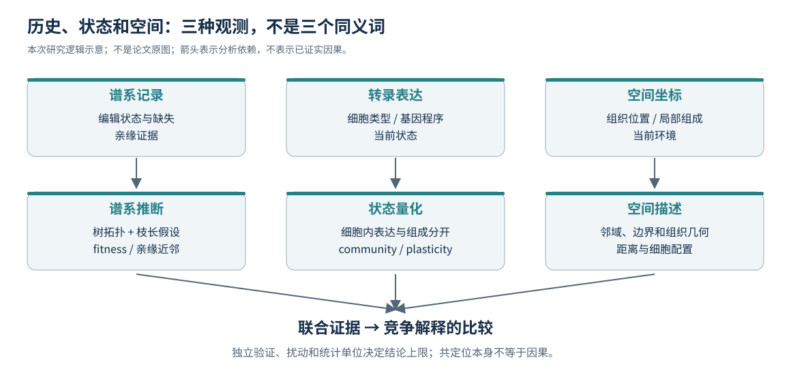

# 02｜研究故事：为什么要把历史、状态和空间放在一起

## 核心矛盾：相似的图像可以来自不同的历史

[I] 一块缺氧区域同时富集某种恶性细胞状态、髓系细胞和成纤维细胞，至少有几种不同解释。其一，一个具有扩增优势的祖先克隆占领局部区域，改变供氧和组织结构，继而影响邻居；其二，局部环境先改变，多个无关克隆在同一区域形成相似状态；其三，遗传改变同时影响扩增与环境；其四，肿瘤尺寸、血管结构、捕获效率等共同因素制造了这些相关性。普通表达空间图本身很难区分它们。

[P] 本文联合演化型谱系追踪与空间转录组，在 Kras／Trp53 驱动的小鼠肺腺癌中研究扩增、可塑性、微环境和转移。[P1]

[I] 独立谱系记录最重要的作用，是让“相邻细胞看起来像”不再是判断亲缘的唯一依据。表达决定状态，记录器编辑支持亲缘，坐标决定当前位置。三个维度相关并不意外，关键是相关性是否来自独立观测，以及数据处理是否又把它们人为耦合起来。

## 第一层设计：区分细胞身份与组织位置

[P] Slide-tags 提供空间映射的单核表达，Slide-seq 提供近细胞尺度的空间表达观测；二者都有谱系读出，但 Slide-seq 观测可能混合多个细胞来源。作者对冲突谱系状态、缺失和树重建采取了平台相关的处理。[P2–P3；C2–C3]

[I] 这是优点也是约束。单核数据帮助判断“究竟是哪一类细胞在表达”；空间捕获则扩大组织覆盖，但一个 spot 的“肿瘤相关程序增强”既可能是肿瘤细胞状态变化，也可能是细胞比例变化。需要在组织、细胞类型内表达和谱系上进行交叉对照，而不能把 spot 直接叫作一个癌细胞。

## 第二层设计：区分共同祖先与共同环境

[P] 作者把树结构和社区表达程序联系起来，并评估扩增相关空间邻域。论文公开证据链包括独立编辑位点热图、模拟与留出插补检验、CNV 对照、单核注释、空间基因模块及组织学验证。[P1：ED1–ED8]

[I] 每一种对照排除的解释不同。留出已观测编辑状态主要验证插补预测能力；它不直接验证迁移区域的祖先树。CNV 一致性是另一类分子证据，但必须有正确的零分布，且没有 CNV 的肿瘤不能因“全部同一组”获得虚假的显著支持。组织学增强空间定位可信度，但不能独自给出祖先—后代关系。去掉社区共享基因后相关性仍在，排除了部分纯基因集重叠效应；并没有排除组织成分共同变化。

## 第三层设计：从状态关联走向环境参与

[P] 作者将扩增亚克隆与缺氧、免疫抑制及纤维化相关生态位联系起来，并通过空间相互作用分析及共培养研究环境和细胞相互作用对癌细胞状态的影响。[P1：Abstract、Fig.3–4；P2]

[I] 共培养的重要性不是让所有配体—受体排序都得到“验证”，而是从纯观测关联迈向对某些环境组合的操纵。加入整个细胞群体、改变氧条件，测试的是复合处理；某个单独配体、受体或反馈环是否必要，仍需相应针对性扰动。不能把“处理改变状态”倒推为原位中某条预测分子轴已经闭合。

## 第四层设计：把转移发生地与转移来源分开

[P] 论文将原发区域中的谱系状态与转移灶关联，提出转移来自空间受限的原发亚克隆，并分析远端转移环境的纤维化、胶原及 TGFβ 相关特征。部分跨层关联使用非插补谱系状态，转移比较会排除不相关病灶。[P1：Fig.5、ED9–10；P2]

[I] “来源于空间受限亚克隆”比“某空间区域表达了转移相关基因”强，因为它使用亲缘约束。但祖先位置仍是回顾性定位，终点取样看不到所有中间细胞与实际离开时间。将连续化分割区域叫作 founder niche 之前，必须展示未平滑的原始支持点；否则算法赋予的连续性会混入生物学结论。

## 如何理解作者提出的阶段性模型

[P] 补充讨论把早期状态多样化与后续扩增／环境改变联系起来，后者伴随缺氧、髓系和间质相关生态位以及促转移状态。[P2：Extended discussion]

[I] 可将其理解为两个逻辑层次，而不是已经测准的两次时间事件。早期：身份约束减弱，状态可达空间增大。后期：某些谱系扩增，空间环境发生结构化改变，状态和生态位相互强化。转移则从这个体系中的部分亲缘分支发生。此模型不能自动推导出“先缺氧、再髓系、最后 CAF”这种精确时间排序；不同箭头的证据强度不同。

## 尚未被完全排除的解释

[I] 空间位置可能通过插补进入树，再通过树产生空间聚集；供氧可能是肿瘤几何的结果而非克隆特有行为；亲缘近邻状态差异可能受注释或 spot 混合影响；某些外部人类队列只是共享表型而不是同样的进化历史；远端器官本来的基质结构可能参与“胶原丰富”差异。指出这些问题，不等于否认论文主线，而是说明后续需要在哪些环节增加独立证据。

[H] 最有辨别力的扩展不是继续寻找“缺氧高、髓系高”的常规区域，而是寻找反例：同等肿瘤密度和距边界条件下，一处扩增强却不缺氧，另一处缺氧强却没有相同谱系扩增；同等髓系比例下，间质重塑是否仍解释肿瘤状态。反例配对比单纯扩大正相关样本量更能缩小解释空间。
