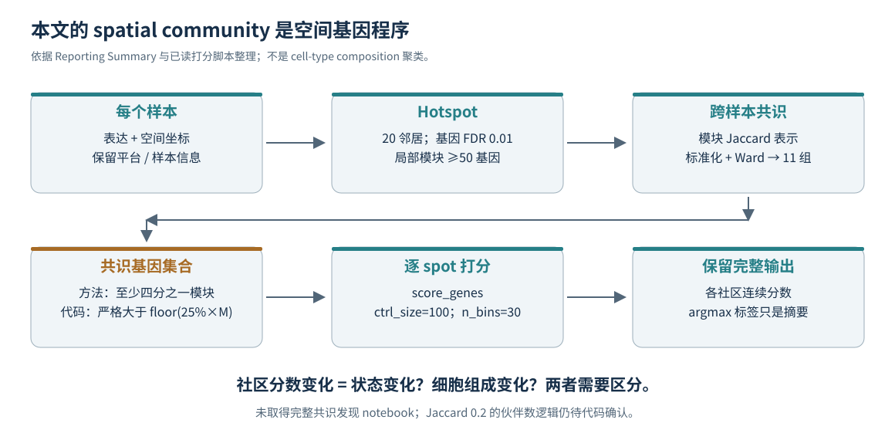

# 05｜空间社区到底怎么计算：不是先统计邻居细胞类型再聚类

## 本文的核心定义

[P] 这里的 spatial community 是跨样本复现的**空间共变基因集合**及其在 spot 上的活性，不是一种单细胞类型。作者先在各样本做 Hotspot，再跨样本整合模块，最后给每个 spot 计算社区分数与最高分标签。流程细节在 Reporting Summary 的“Slide-seq spatial community detection and scoring”中，不应因为 Supplementary Information 某处没有重复写就认定作者完全未报告。[P3：PDF 第3页]

## 输入合同

[P/C] 需要表达矩阵、空间坐标、样本／肿瘤对应关系，以及后续的模块成员表。模块打分脚本还需要已生成的 `hotspot_modules_consensus.tsv`，它本身不从零生成所有 Hotspot 模块。[P3；C6]

[I] 单一 spot 的表达向量含有细胞状态与细胞组成的共同贡献。坐标用于识别局部结构；跨样本模块共识用于寻找相似的空间程序。这与“每个细胞周围 20 个邻居的 cell-type composition 向量再聚类”的 cellular-neighborhood 流程，不是同一个特征空间。

## 第一步：每个样本的空间图与空间基因模块

[P] 作者声明以空间坐标建立 20 邻居图，筛选 FDR 0.01 的空间自相关基因，模块最少 50 个基因。[P3]

[I] Hotspot 不是简单对所有细胞的 Pearson 基因相关矩阵聚类。它利用局部邻接关系寻找与所选观测结构相关的变化，并进一步寻找局部共变模块。用于表达的统计模型、计数矩阵／归一化矩阵及具体软件调用仍需最终 notebook 核查，不能因熟悉 Hotspot 就替作者填写未取得的参数。[B1；P3]

## 第二步：跨样本寻找共识

[P] 作者计算不同样本模块的 Jaccard 重叠，对相似性进行标准化并用 Ward 层次聚类形成 11 个共识集合；随后用出现频率筛选共识基因。[P3]

[I] 对两个基因集 A、B，J(A,B)=|A∩B|/|A∪B|。这衡量基因成员重叠，不是两个空间区域的几何重叠；跨切片不需要坐标已经精确配准，也可以比较基因模块。Ward 聚类作用于经过标准化的相似性表示，不应在没有调用代码时直接等同于“对 1−J 距离做 Ward”。

**有一处原文措辞仍需代码澄清**：模块筛选关于 Jaccard≥0.2 和 “at most one other module” 的句子存在解释歧义。本包保留这一点，没有替作者改成习惯性的“至少另一个模块”。`community_analysis.ipynb` 的全部执行单元尚未审计，因此这一门槛不能自动写成已验证的可执行过滤表达式。[P3；R1]

## 第三步：共识基因集合

[P] 方法描述保留在集合内至少四分之一的模块中出现的基因。[P3]

[C] 已读打分脚本实际条件为 `count > int(0.25 * n_modules)`。例如 4 个模块中出现 1 次的基因，按“至少四分之一”应保留，按这段代码则删除。此差异只在某些边界出现，不是所有基因集都改变；需要最终基因表来计算真实影响。[C6；T1]

[I] 还要澄清共识组成单位是 sample、tumor 还是 module；同一动物拥有很多切片时，可贡献更多模块。出现频率高不必然代表跨动物复现。严谨的验证需要按动物留一，将被留出的动物从基因集发现过程移除，再给它打分。

## 第四步：对每个 spot 打分

[C] 打分代码做按样本的中位文库量归一化、log1p 和 scale，然后调用 `score_genes`，`ctrl_size=100`，`n_bins=30`。[C6]

[I] 可以把评分理解为模块基因的平均标准化表达，扣除匹配表达水平的对照基因平均表达。具体随机对照基因集合及版本依赖仍需固定。它不是“模块内转录本所占百分比”，不是概率，也不是绝对氧浓度。

[P] 每个 spot 的社区标签取最高分模块。[P3]

[I] 最高分标签把连续、多维、可能混合的程序压成单个类别。第一名只比第二名高一点与远高于其他模块的点，都会被涂同一种颜色。只保留 label 会丢失不确定性和混合态；建议同时保留全分数向量、第一／第二名差值、模块间相关性及合格基因覆盖数。

## 输出应该是什么

[H] 为可复查分析，最少应保留：每个样本的局部模块表、跨模块 Jaccard 矩阵、共识模块成员关系、最终基因集合、每个 spot 的全部社区分数、argmax 标签及评分所用对照基因。这里是本包建议的产物合同，不宣称作者公开仓库已按这些精确文件名完整提供。

## 对 Xenium 最容易犯的误迁移

[H] 对有限面板直接照搬全转录组模块，可能让一个几十基因的社区仅由一两枚探针决定。应先制作 `module × panel_gene` 覆盖表，区分未在面板上与测得为零；少数探针无法定义的模块标为不可识别。不能用插补表达把缺失面板的证据变成真实测量。

[H] 本文社区可与 cell-type composition niche 互补，但不能混名：前者偏向组织程序，后者偏向细胞配置。在 Xenium 中可分别建模，再问“同样的细胞组成是否对应不同程序”以及“相似程序是否由不同细胞组合产生”。这比统一套一个 niche 聚类后笼统称为生态位机制更有解释力。
