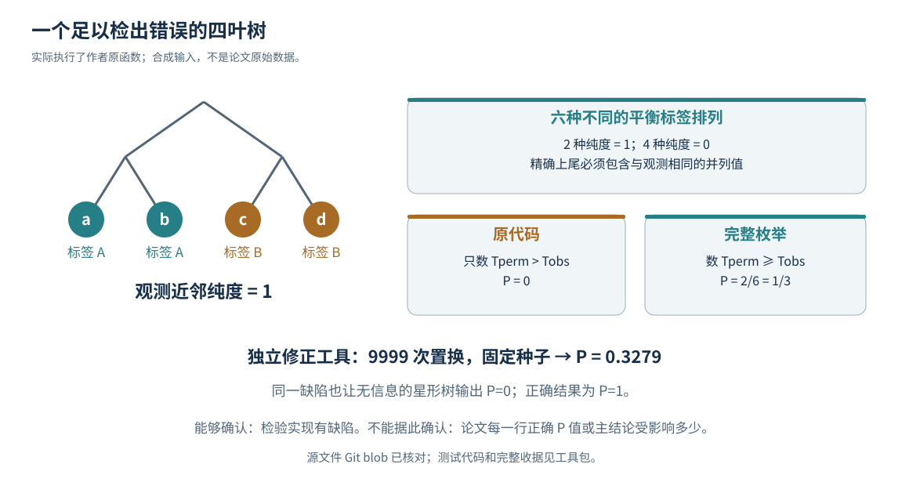

# 07｜实际执行了什么：原函数反例、表重数与回归检查

执行收据见 `audit/deep_audit_results.json` 和 `audit/inherited_checks_rerun.json`，包括运行时间、Python 版本、每项观测与适用范围。**没有装载作者 pickle，没有读取原始 AnnData，没有重建真实肿瘤树，没有重算论文的生物学效应或图片。**

## 原文件身份如何确认

本包的 CNV 检验脚本、公开结果表、阵列元数据使用 Git blob 算法计算 SHA-1，并与固定提交目录元数据比对。三者分别匹配：

|文件|字节数|Git blob SHA-1|
|---|---:|---|
|bootstrap_phylo_infercnv_slidetags.py|4730|`c0e30a3714d65fdce3fe82977d415203efa4dee3`|
|slidetags_infercnv_nn_score.tsv|581|`102b2344fd9668e0bde33af7616299c534768577`|
|puck_meta.txt|2043|`75b5f677202c1655fba4a7281df9cdd82261d403`|

这比“复制了一段看起来一样的代码”强，但不能证明这三个文件产生了终刊所有结果。两个新增 Cassiopeia 文件是**明确标记的片段**，只有本地 SHA-256，不声称完整 Git blob 一致。[T1]

## 如何执行作者函数而不触发作者整条脚本

`tools/deep_audit.py` 先核对字节身份，再用 AST 仅提取五个已审读函数定义：最近邻搜索、全部最近邻、纯度、标签打乱、置换检验。原文件顶层 imports、绝对路径读表、pickle 读取和完整分析循环都不执行。用一个标准库实现的微型树对象提供这些函数需要的 API；因此这是**原函数在明确合成输入上的行为验证**，不是 Cassiopeia 真树重跑。

## 反例一：全部同一标签，无检验信息

四叶星形树，每个叶子都有相同 CNV 标签。无论如何置换，纯度都等于 1。原函数：观测 1、P=0。包含等值的正确尾概率：1，且应标记零分布退化。

这个例子不仅是极端数学构造：对没有可分辨 CNV 亚组的肿瘤，同一标签恰好意味着这个对照没有区分能力。不能从“完全一致”直接推出“强力支持谱系”。不论论文实际有多少此类肿瘤，都应先检测该退化情形。

## 反例二：两种标签，也可以完全没有信息

仍用四叶星形树，标签为 A、A、B、B。每个叶子的三个邻居中永远有一个同标签，故任何置换的平均纯度都等于 1/3。原函数 P=0，正确 P=1。这说明缺陷不是只影响“全部一个标签”的特例。

## 反例三：有区分信息的二叉树

树为 `((a,b),(c,d))`，标签 a、b 属于 A，c、d 属于 B。观测纯度为 1。在六种不同的平衡标签排列中，两种纯度为 1，四种为 0。因此完整枚举上尾概率是 2/6=1/3；原函数只计 >1，输出 0。

独立修正 helper 在种子 20260916、9999 次随机置换下得到 **0.3279**，接近精确 1/3。这只是合成例的 Monte Carlo 结果，不是论文 P 值。



## 公开结果表只做了重数，没有重新推断

本包对公开表重新计数：15 行，8 行 NN_score=1，14 行 Significance=0。最低纯度约 0.67136。它证实当前公开表具有需要关注的饱和值，不提供各行正确 P 值、置信区间或显著性修正。[D2；T1]

元数据重新计数：49 个阵列，44 Slide-seq、5 Slide-tags，24 个不同 Mouse ID；SPC-11 占 21 个 Slide-seq 阵列，并包含全部五个 Slide-tags 阵列。这提示不同分析的有效重复单位必须单独列出，不能仅按 array 计 n。[D1；T1]

## 其余检查的性质

新增检测还包含：传入邻居缓存后实际函数仍重复搜索；在非超度量合成树上，祖先子树最近邻不等于全局路径最近邻；状态集合最小联接不满足三角不等式；细胞级保留会保留弱 allele 行；四分之一严格阈值边界；负值条件下除最大值的范围问题；Cassiopeia 输出字段选段；独立 helper 的无效输入、随机种子和分块回归；PBMA 报告数字的算术冲突。

旧包十项检查在本次重跑成功，涉及元数据身份与层级、解包、剪枝集合、阈值、覆盖与文件接口。**32 项通过不是 32 个独立新漏洞：其中包括身份校验、同一问题的不同反例和我们自己的工具回归。**这样计数是为了便于重跑与审查，而不是用通过率制造科学可靠性的错觉。

## 重跑命令

```bash
python tools/inherited_audit_checks.py --output audit/inherited_checks_rerun.json
python tools/deep_audit.py --output audit/deep_audit_results.json
```

审计工具仅使用 Python 标准库；不需要下载 6.1 GB 原始分析包。运行会更新这两份收据，因此之后原始 `SHA256SUMS.txt` 对收据的校验会变化；原始 ZIP 中的收据和哈希是首次交付证据，应另存再运行。
