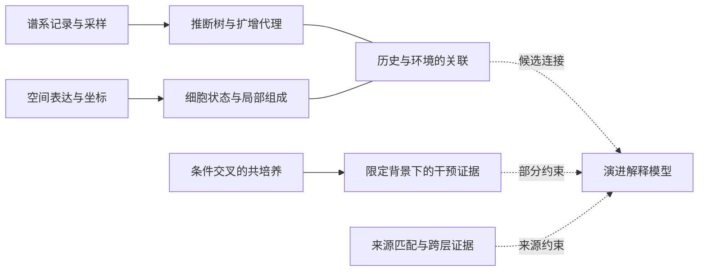

# 01｜文章的故事：从静态组织到受证据约束的演进模型

[返回阅读入口](../README.md) · 下一章：[研究设计与证据](02-design-and-evidence.md)

## 1. 先把论文问题翻译成没有术语也能理解的问题

【论文报告】研究在 Kras/Trp53 驱动的小鼠肺腺癌系统中，把高分辨率空间表达与不断累积的谱系记录联合起来。作者关注扩增、细胞状态可塑性及转移，如何与局部微环境共同变化。摘要提出，扩增亚克隆伴随低氧、免疫抑制和纤维化环境；转移与空间受限的原发亚克隆相关，并在远端出现富胶原环境。定位：[P1，Abstract；Fig.1、3–5](../evidence/SOURCES.md#p1)。

【解释】可以把问题拆成四个普通问题：这些细胞现在在哪里？现在做什么？彼此是什么亲缘关系？周围什么条件与它们的变化有关？困难在于，这四个问题需要不同的证据。一个分群图、一张通信热图或者一条拟时序，都不能独自回答全部问题。

本文真正有价值的不是把这些图放在一起，而是把**当前状态的观测**与**历史关系的约束**分开取得，再考察二者如何与环境连接。即使原文有很强的整体叙事，读者仍应逐条判断连接的证据类型。

## 2. 为什么同一空间现象允许多种解释

【解释】设某区域同时有扩增相关指标较高的细胞、低氧相关表达和特定间质群体。下列模型都可能产生相似终点图像，它们是本整理提出的竞争解释框架，不是声称作者预先登记了这些模型。

| 模型 | 可能过程 | 单张终点图不能排除什么 |
|---|---|---|
| M1：内在变化先行 | 某些细胞先获得扩增优势，再改变周围资源与细胞组成 | 环境也可能在此前已不同 |
| M2：环境先行 | 原有局部条件选择或诱导特定细胞状态，使其富集 | 富集可能来自存活/扩增，而非状态转换 |
| M3：双向反馈 | 扩增改变环境，环境再改变状态及扩增 | 没有单一全局起点，箭头可能随阶段改变 |
| M4：共同背景 | 肿瘤大小、组织几何、密度或血供同时影响两类读数 | 共定位不要求直接相互作用 |
| M5：测量和处理贡献 | 取样、缺失、混合观测、空间插补或共享基因使两类量相关 | 更平滑的图不一定包含更多独立证据 |

这里并不要求每个模型互斥。一个真实系统完全可能同时存在 M1、M3 和 M4。研究设计的目标，是逐步排除某些解释、明确剩余解释，而不是事后用一句“复杂微环境”容纳所有现象。

## 3. 故事第一幕：先获得能约束历史的测量

【论文报告】Fig.1 建立空间—谱系联合平台。Slide-seq 的空间观测可能混入多个细胞，Slide-tags 则提供空间映射的单核观测；谱系分析需要处理两种观测单位的差异。[P1，Fig.1、ED1–3；P2，lineage processing / phylogenetic reconstruction](../evidence/SOURCES.md#p2)。

【解释】表达相似并不能区分共同祖先与环境趋同。增加可遗传记录，才有机会将二者分开。但是“有历史记录”也不等于“完整真实历史”。记录缺失、相同编辑重复发生、采样不足以及树重建假设，仍会限制分辨率。

**不可缺环节：**少了谱系记录或等价的历史证据，原发灶和转移灶的表达相似就不能被直接写成确定的亲缘来源。

**重要限定：**独立的测量通道不保证全部后处理仍独立。部分谱系缺失使用空间信息补全，空间先验由此进入树，需以留出数据、非插补分支或正交信息评估依赖。

## 4. 故事第二幕：把“组织由什么组成”与“细胞处于什么状态”拆开

【论文报告】Fig.2 组织空间表达 communities 与细胞注释；ED5 还考察共识模块共享基因对模块间相关性的影响。[P1，Fig.2、ED4–5](../evidence/SOURCES.md#p1)。

【代码事实】公开的共识模块打分脚本读取预先给定的模块基因，对每个样本处理后调用 `score_genes`；它本身不是整个模块发现流程。[C6](../evidence/SOURCES.md#c6)。

【解释】区域表达可以变化，是因为某类细胞变多，也可以因为同类细胞表达变强，或因为两个过程并存。一个高分 community 因而不是另一种单细胞类型。若把区域总分变化一律解释为肿瘤细胞重编程，就可能把组织组成变化当成细胞内变化。

**不可缺环节：**少了独立的组成信息或同类型细胞分析，不能从混合区域总表达直接推出某类响应细胞自身改变了状态。

## 5. 故事第三幕：给空间区域加上扩增历史的索引

【论文报告】Fig.3 将亚克隆扩增与局部低氧、纤维化、免疫抑制环境的关联连接起来。补充方法分别定义基于树的 fitness 与 plasticity，并在高低 fitness 周围比较邻域表达或组成。[P1，Fig.3；P2，Phylogenetic fitness inference / neighbourhood analyses](../evidence/SOURCES.md#p2)。

【解释】这一步把问题从“大肿瘤和小肿瘤有什么差别”，推进到“同一组织中，与不同扩增历史相关的位置，其环境是否不同”。但空间定位更精细，不等于因果识别自动更强。

必须区别三个层次：树与分支长度产生扩增代理；代理与邻域量产生关联；干预扩增或环境才可能约束因果方向。本文的模型可以把这些层次连起来，读者不能因此把所有层次改称直接测量。

**不可缺环节：**没有参照明确的扩增量，就不能把区域命名为扩增生态位；没有正确的树叶集合与分组，实现也可能偏离名义分析对象。代码问题见第四章。

## 6. 故事第四幕：从共定位走向条件依赖的干预

【论文报告】Fig.4 联合空间配体—受体候选分析与共培养。补充方法交叉改变氧条件和培养背景，比较肿瘤单独培养及加入其他细胞的体系。[P2，Cell-cell communication analysis；Establishing lung organoid co-cultures](../evidence/SOURCES.md#p2)。

【解释】最重要的增量不是“又做了一个实验”，而是允许比较同一个因素在不同背景中的效应。它可区分一个因素是否普遍作用，还是需要某种背景才出现特定响应。

但是，改变整个培养体系的氧条件，并非只改变肿瘤细胞；加入多个细胞群，也同时改变了密度、资源需求和相互作用机会。终点读数变化可以来自诱导，也可以来自选择性扩增或死亡。没有细胞类型特异操纵、明确终点来源和适当对照，就不能锁定单一中介通路。

**不可缺环节：**如果四种因素—背景组合中缺少关键对照，就无法充分区分因素效应、背景效应和二者交互。若只报告一组显著、一组不显著，也未直接检验两组效应是否不同。

## 7. 故事第五幕：用来源限定转移比较，而不是只按位置命名

【论文报告】Fig.5 将原发灶空间亚克隆与转移联系起来。ED9a 说明两处淋巴结病灶未发现与重点原发灶相关，因此未纳入相应比较；跨层匹配另使用非插补谱系数据。定位：[P1，Fig.5、ED9；P2，Coarse-grained alignment / metastatic analyses](../evidence/SOURCES.md#p2)。

【解释】“同一动物中同时有原发灶和转移灶”不是完整来源证据。先限定亲缘来源，可以避免把另一个肿瘤的状态或环境错误归到被研究的原发灶。

这也不等于知道唯一一个真实 founder、全部转移路线或细胞离开原发灶的精确时间。阈值下的共识状态匹配与生物学上唯一的播散事件，仍不是同一概念。

**不可缺环节：**没有来源约束，就不能把区域差异可靠归入同一条候选演进链；没有原始/非插补对照和支持度，空间先验可能参与决定被拿来解释的来源。

## 8. 本文“时间”至少有四种，不能合并

【解释，依据 P2 与公开元数据 D1】真实取材时间、谱系上的相对祖先顺序、不同组织层深、表达拟时序是不同变量。`Layer1–Layer4` 表示研究中的组织层级命名，不能解释为四个疾病阶段；同一动物的不同阵列也不等于连续活体观察。

作者依靠谱系约束与末端空间结构重建历史的一部分；分期 Xenium 的优势是可以拥有实验时间锚点，但不同动物的终点样本仍不是同一细胞的连续记录。这一对应关系在[项目章](../project/01-xenium-translation.md)单独展开。

## 9. 最终模型应该怎样读

该图是本整理的证据依赖示意，不是作者图的复刻。实线表示分析输入关系，虚线表示对解释的约束；它不是所有生物学箭头均已验证的因果图。

## 10. 作者自己已经写出的限制，不应被精读文章删掉

【论文报告】补充讨论指出，单一切片可能不能代表全部克隆动态；空间取样和稀疏性降低编辑多样性与树分辨率；高迁移系统可能不满足空间插补所需的局部一致性；树只是谱系估计，死亡率不均匀和未观测中间状态会影响派生指标。[P2，extended discussion，PDF 第4页](../evidence/SOURCES.md#p2)。

【解释】因此，一个有价值的后续 idea 不是否认这些限制，也不是因为期刊层级高而忽略它们，而是把限制转化成可区分模型的设计。后面的四条启发就以这一目标筛选。
