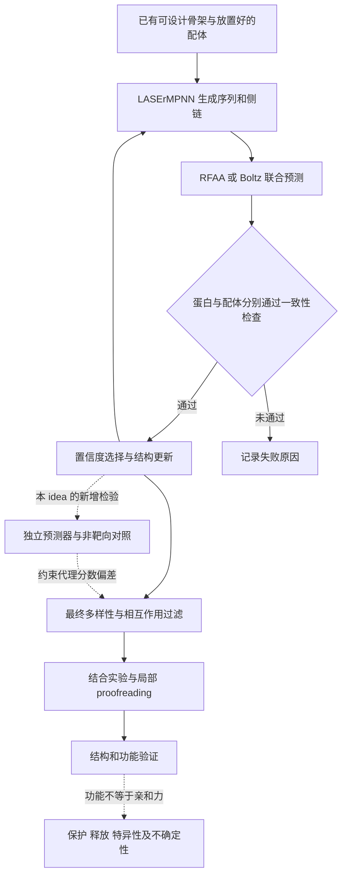

# 从 NISE / LASErMPNN 到可信的闭环蛋白设计

## 一篇论文的完整故事、方法拆解、研究见解与可执行分析

**核心问题：能否把「生成一个看起来合理的蛋白」升级为「在有限预算内，得到结构、结合与目标功能均有独立证据支持的蛋白」？**

本 idea 以 Fry、Slaw 与 Polizzi 的论文 *Zero-shot design of drug-binding proteins via neural iterative selection–expansion* 为起点。论文发表于 **Nature，2026 年 6 月 24 日**，卷 656，237–249；DOI：[10.1038/s41586-026-10670-w](https://doi.org/10.1038/s41586-026-10670-w)。

它真正值得迁移的不是某个软件名字，而是：**让序列设计器与联合结构预测器互相更新对方的输入，把蛋白序列、骨架与配体构象作为一个耦合问题；再用不等价的独立证据限制这个闭环的自我强化。**

> **阅读边界**：本文是论文解读、方法重建、独立数学分析与后续研究方案，不是已完成的论文全量复现。所有实验亲和力和命中数均标为作者报告；本目录的轻量代码用于几何、筛选、概率比较及结合模型的分析与测试，不包含训练好的生成模型，也不替代 RFAA / Boltz / LASErMPNN。

## 推荐阅读路径

| 顺序 | 文档 | 读完应能回答的问题 |
|---|---|---|
| 1 | [论文故事](docs/01_story.md) | 作者为什么做这项研究，每一步怎样支持下一步？ |
| 2 | [研究设计与逐图证据](docs/02_design_and_figures.md) | 每个比较究竟控制了什么，哪些结论没有被证明？ |
| 3 | [方法与数学](docs/03_methods.md) | 两个模型如何闭环，RMSD、pLDDT、NLL、Kd 各是什么？ |
| 4 | [八条深入见解](docs/04_insights.md) | 哪些经验可以迁移，哪些必须通过新实验检验？ |
| 5 | [完整研究 idea](docs/05_research_proposal.md) | 怎样把这些见解组织成一个可证伪、可执行的课题？ |
| 6 | [代码与运行路线](docs/06_code_and_execution.md) | 官方代码在哪里，本目录代码做什么，如何运行？ |
| 7 | [统计与定量解析](docs/07_statistics.md) | 如何正确拟合紧结合、比较突变、报告命中率？ |
| 8 | [证据状态与限制](docs/08_evidence_and_limits.md) | 已核实、已测试、未取得、未执行的内容分别是什么？ |
| 9 | [来源与固定版本](evidence/SOURCES.md) | 如何回到原文、源码与数据入口？ |

每章都有前后导航。首次阅读建议按顺序；执行者可直接阅读第 6 章，但不要省略第 7、8 章的适用条件。

## 论文与本 idea 的关系



**作者已建立的主线**：NISE 闭环设计 → EPIC / APEX 结合实验 → EPIC 局部校对 → 晶体结构与体外水解保护。

**本 idea 新提出、尚待验证的主线**：预算匹配的闭环对照 → 与优化器分离的评估 → holo / apo / 非靶向条件比较 → 以真实结合和功能为终点的决策，而不是继续最大化一个模型分数。

## 最容易记错的四件事

1. exatecan 原论文主分支使用 **RFAA**；apixaban 原论文分支使用 **Boltz-2**。公开 Boltz 示例不是两条历史路线的共同配置。
2. 自洽同时包括**蛋白骨架**和**配体在蛋白坐标系中的姿态**。单独对齐配体再算 RMSD 会掩盖错误结合位点。
3. pLDDT、P(bind)、序列 NLL 和实验 Kd 不可互换，尤其不能把 P(bind) 换算为 Kd。
4. 「4/4 或 5/6」是经过计算筛选后送检集合的结果，不是任意药物、任意骨架、任意序列的成功概率。

上述论文事实的原文定位见 [来源 S1](evidence/SOURCES.md) 与 [逐图证据表](docs/02_design_and_figures.md)。

## 代码入口

```bash
cd nise-lasermpnn-2026
python -m pip install -r requirements.txt
python -m unittest discover -s tests -v
python scripts/run_demo.py --output results/my_demo
```

示例数据由固定随机种子生成，输出明确标注 `synthetic_demo`。测试通过只支持代码实现的数学或输入检查，不代表论文实验被复现。详细输入合同、输出含义和真实数据接入方法见 [第 6 章](docs/06_code_and_execution.md)。

## 导航与来源原则

文中使用五种明确标签：**作者报告**、**源码观察**、**数学推导**、**本项目测试**、**待验证假设**。未公开或本次未取得的参数不通过「常用默认值」补成论文参数。原论文补充方法、设计档案和模型权重的缺口保留在 [状态说明](docs/08_evidence_and_limits.md)。

整理日期：2026-09-11。除另行标注的引用外，文字是原创中文解释与研究设计；不复制完整原文、实验数据或模型权重。
